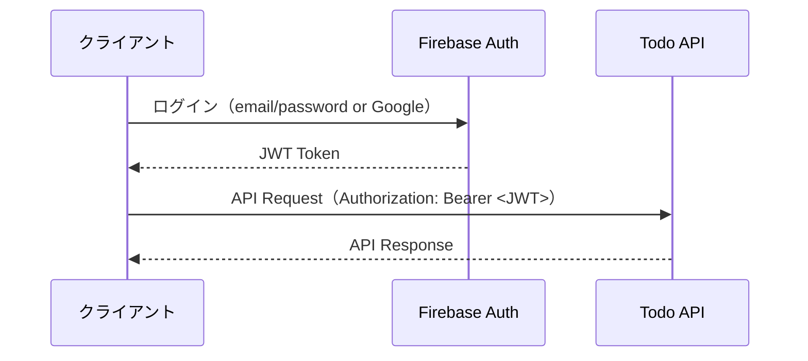
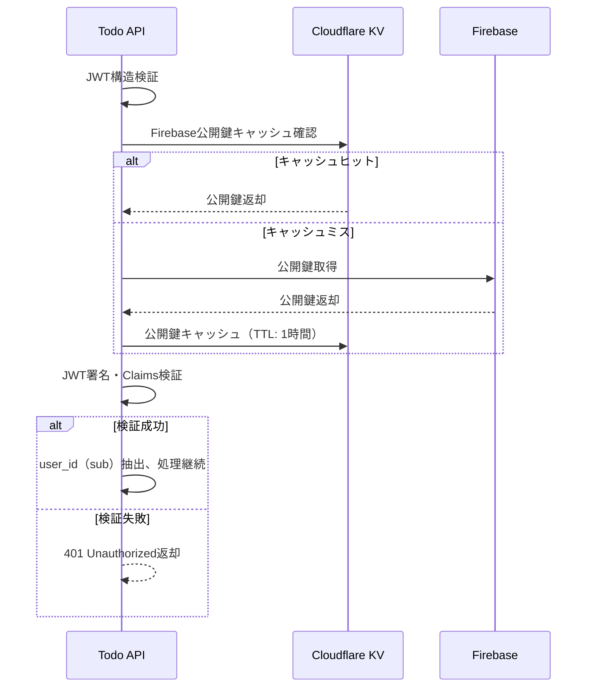

# API仕様書（OpenAPI 3.0準拠）

## 概要

本APIは、Cloudflare Workers上で動作するHonoフレームワークベースのToDoアプリケーションAPIです。  
Firebase AuthenticationによるJWT認証を使用し、RESTful APIとして設計されています。

- **Base URL**: `https://your-worker.your-subdomain.workers.dev`
- **認証方式**: Bearer Token（Firebase JWT）
- **レスポンス形式**: JSON
- **文字エンコーディング**: UTF-8

## 認証

### 認証方式
Firebase AuthenticationによるJWT認証を使用します。

```http
Authorization: Bearer <firebase-jwt-token>
```

### JWT Token取得フロー



## エラーレスポンス共通仕様

```typescript
interface ErrorResponse {
  success: false;
  error: {
    code: string;           // エラーコード
    message: string;        // エラーメッセージ（日本語）
    details?: string;       // 詳細情報（開発時のみ）
  };
  timestamp: string;        // ISO 8601形式
  request_id: string;       // リクエストID（トレーシング用）
}
```

### エラーコード一覧

| コード | HTTPステータス | 説明 |
|--------|---------------|------|
| `UNAUTHORIZED` | 401 | 認証が必要、またはトークンが無効 |
| `FORBIDDEN` | 403 | アクセス権限がない |
| `NOT_FOUND` | 404 | リソースが見つからない |
| `VALIDATION_ERROR` | 400 | リクエストデータのバリデーションエラー |
| `INTERNAL_ERROR` | 500 | サーバー内部エラー |

## API エンドポイント

### 1. 認証確認 API

#### `POST /api/auth/verify`

JWT認証確認とユーザー情報取得

```typescript
// Request Headers
{
  "Authorization": "Bearer <firebase-jwt-token>",
  "Content-Type": "application/json"
}

// Request Body
{} // 空のオブジェクト

// Success Response (200)
{
  "success": true,
  "data": {
    "user": {
      "id": "firebase-user-uid",
      "email": "user@example.com",
      "display_name": "John Doe",
      "created_at": "2024-01-01T00:00:00.000Z",
      "updated_at": "2024-01-01T00:00:00.000Z"
    }
  },
  "timestamp": "2024-01-01T00:00:00.000Z",
  "request_id": "req_123456789"
}

// Error Response (401)
{
  "success": false,
  "error": {
    "code": "UNAUTHORIZED",
    "message": "認証が必要です",
    "details": "JWT token is invalid or expired"
  },
  "timestamp": "2024-01-01T00:00:00.000Z",
  "request_id": "req_123456789"
}
```

### 2. ToDoタスク一覧取得 API

#### `GET /api/todos`

ユーザーのToDoタスク一覧を取得（ページネーション・フィルタリング・ソート対応）

```typescript
// Request Headers
{
  "Authorization": "Bearer <firebase-jwt-token>"
}

// Query Parameters
interface TodoListQuery {
  page?: number;                    // ページ番号（1～、デフォルト：1）
  limit?: number;                   // 取得件数（1～100、デフォルト：20）
  completed?: 'true' | 'false';     // 完了状態フィルタ
  due_before?: string;              // 期限日前フィルタ（ISO 8601）
  due_after?: string;               // 期限日後フィルタ（ISO 8601）
  sort?: 'created_at' | 'due_date' | 'title';  // ソート項目（デフォルト：created_at）
  order?: 'asc' | 'desc';           // ソート順（デフォルト：desc）
  search?: string;                  // タイトル・説明文の全文検索
}

// 例: GET /api/todos?page=1&limit=10&completed=false&sort=due_date&order=asc

// Success Response (200)
{
  "success": true,
  "data": {
    "todos": [
      {
        "id": "01234567-89ab-cdef-0123-456789abcdef",
        "user_id": "firebase-user-uid",
        "title": "買い物リストを作成する",
        "description": "明日のパーティー用の食材を購入する",
        "completed": false,
        "due_date": "2024-12-25T10:00:00.000Z",
        "created_at": "2024-01-01T00:00:00.000Z",
        "updated_at": "2024-01-01T00:00:00.000Z",
        "slug": "shopping-list-creation"
      }
    ],
    "pagination": {
      "page": 1,
      "limit": 20,
      "total": 45,
      "total_pages": 3,
      "has_next": true,
      "has_prev": false
    },
    "filters": {
      "completed": false,
      "sort": "due_date",
      "order": "asc"
    }
  },
  "timestamp": "2024-01-01T00:00:00.000Z",
  "request_id": "req_123456789"
}
```

### 3. ToDoタスク作成 API

#### `POST /api/todos`

新しいToDoタスクを作成

```typescript
// Request Headers
{
  "Authorization": "Bearer <firebase-jwt-token>",
  "Content-Type": "application/json"
}

// Request Body
{
  "title": "新しいタスク",                    // 必須、1～200文字
  "description": "タスクの詳細説明",          // 任意、最大1000文字
  "due_date": "2024-12-25T10:00:00.000Z"   // 必須、ISO 8601形式（未来日時）
}

// Success Response (201)
{
  "success": true,
  "data": {
    "todo": {
      "id": "01234567-89ab-cdef-0123-456789abcdef",
      "user_id": "firebase-user-uid",
      "title": "新しいタスク",
      "description": "タスクの詳細説明",
      "completed": false,
      "due_date": "2024-12-25T10:00:00.000Z",
      "created_at": "2024-01-01T00:00:00.000Z",
      "updated_at": "2024-01-01T00:00:00.000Z",
      "slug": "new-task-20240101"
    }
  },
  "timestamp": "2024-01-01T00:00:00.000Z",
  "request_id": "req_123456789"
}

// Validation Error Response (400)
{
  "success": false,
  "error": {
    "code": "VALIDATION_ERROR",
    "message": "入力データに問題があります",
    "details": {
      "title": ["タイトルは必須です", "タイトルは200文字以内で入力してください"],
      "due_date": ["期限日時は未来の日時を指定してください"]
    }
  },
  "timestamp": "2024-01-01T00:00:00.000Z",
  "request_id": "req_123456789"
}
```

### 4. ToDoタスク詳細取得 API

#### `GET /api/todos/:slug`

指定したスラッグのToDoタスク詳細を取得

```typescript
// Request Headers
{
  "Authorization": "Bearer <firebase-jwt-token>"
}

// Path Parameters
{
  "slug": "shopping-list-creation"    // タスクのスラッグ
}

// Success Response (200)
{
  "success": true,
  "data": {
    "todo": {
      "id": "01234567-89ab-cdef-0123-456789abcdef",
      "user_id": "firebase-user-uid",
      "title": "買い物リストを作成する",
      "description": "明日のパーティー用の食材を購入する",
      "completed": false,
      "due_date": "2024-12-25T10:00:00.000Z",
      "created_at": "2024-01-01T00:00:00.000Z",
      "updated_at": "2024-01-01T00:00:00.000Z",
      "slug": "shopping-list-creation"
    }
  },
  "timestamp": "2024-01-01T00:00:00.000Z",
  "request_id": "req_123456789"
}

// Not Found Response (404)
{
  "success": false,
  "error": {
    "code": "NOT_FOUND",
    "message": "指定されたタスクが見つかりません"
  },
  "timestamp": "2024-01-01T00:00:00.000Z",
  "request_id": "req_123456789"
}
```

### 5. ToDoタスク更新 API

#### `PUT /api/todos/:slug`

指定したスラッグのToDoタスクを更新

```typescript
// Request Headers
{
  "Authorization": "Bearer <firebase-jwt-token>",
  "Content-Type": "application/json"
}

// Path Parameters
{
  "slug": "shopping-list-creation"
}

// Request Body（部分更新対応）
{
  "title": "更新されたタスクタイトル",      // 任意、1～200文字
  "description": "更新された説明",        // 任意、最大1000文字（null可）
  "completed": true,                    // 任意、boolean
  "due_date": "2024-12-26T10:00:00.000Z" // 任意、ISO 8601形式
}

// Success Response (200)
{
  "success": true,
  "data": {
    "todo": {
      "id": "01234567-89ab-cdef-0123-456789abcdef",
      "user_id": "firebase-user-uid",
      "title": "更新されたタスクタイトル",
      "description": "更新された説明",
      "completed": true,
      "due_date": "2024-12-26T10:00:00.000Z",
      "created_at": "2024-01-01T00:00:00.000Z",
      "updated_at": "2024-01-02T00:00:00.000Z",
      "slug": "shopping-list-creation"
    }
  },
  "timestamp": "2024-01-02T00:00:00.000Z",
  "request_id": "req_123456789"
}
```

### 6. ToDoタスク削除 API

#### `DELETE /api/todos/:slug`

指定したスラッグのToDoタスクを削除（論理削除）

```typescript
// Request Headers
{
  "Authorization": "Bearer <firebase-jwt-token>"
}

// Path Parameters
{
  "slug": "shopping-list-creation"
}

// Success Response (200)
{
  "success": true,
  "data": {
    "message": "タスクが正常に削除されました",
    "deleted_todo": {
      "id": "01234567-89ab-cdef-0123-456789abcdef",
      "slug": "shopping-list-creation",
      "title": "買い物リストを作成する",
      "deleted_at": "2024-01-02T00:00:00.000Z"
    }
  },
  "timestamp": "2024-01-02T00:00:00.000Z",
  "request_id": "req_123456789"
}
```

## データモデル

### Todo型定義

```typescript
interface Todo {
  id: string;                    // UUID
  user_id: string;               // Firebase UID
  title: string;                 // タスクタイトル（1～200文字）
  description: string | null;    // タスク説明（最大1000文字、null可）
  completed: boolean;            // 完了状態
  due_date: string;              // 期限日時（ISO 8601形式）
  created_at: string;            // 作成日時（ISO 8601形式）
  updated_at: string;            // 更新日時（ISO 8601形式）
  slug: string;                  // URL用スラッグ（ユニーク）
}

interface User {
  id: string;                    // Firebase UID
  email: string;                 // メールアドレス
  display_name: string;          // 表示名
  created_at: string;            // 作成日時（ISO 8601形式）
  updated_at: string;            // 更新日時（ISO 8601形式）
}
```

## バリデーション仕様

### 共通ルール
- 全ての文字列は前後の空白が自動削除される
- HTMLタグは自動でエスケープされる
- SQLインジェクション対策が適用される

### フィールド別バリデーション

#### title（タスクタイトル）
- **必須**: Yes
- **型**: string
- **長さ**: 1～200文字
- **制約**: HTMLタグ不可、改行文字不可

#### description（タスク説明）
- **必須**: No
- **型**: string | null
- **長さ**: 最大1000文字
- **制約**: HTMLタグは自動エスケープ

#### due_date（期限日時）
- **必須**: Yes（作成時のみ）
- **型**: string（ISO 8601形式）
- **制約**: 未来の日時のみ（作成時）、過去日時も更新可能

#### completed（完了状態）
- **必須**: No
- **型**: boolean
- **デフォルト**: false

## 認証・セキュリティ

### JWT検証



### 検証項目
- **exp**: トークン有効期限
- **iss**: 発行者（Firebase）
- **aud**: 対象プロジェクト
- **sub**: ユーザーID（Firebase UID）
- **署名**: Firebase公開鍵による検証

### CORS設定

```typescript
const corsHeaders = {
  "Access-Control-Allow-Origin": "https://your-app.pages.dev",
  "Access-Control-Allow-Methods": "GET, POST, PUT, DELETE, OPTIONS",
  "Access-Control-Allow-Headers": "Content-Type, Authorization",
  "Access-Control-Allow-Credentials": "true",
  "Access-Control-Max-Age": "86400"
};
```

## OpenAPI 3.0 スキーマ

完全なOpenAPIスキーマファイルは `docs/openapi.yaml` に格納されています。  
Swagger UIでの閲覧は `https://your-worker.your-subdomain.workers.dev/` で可能です。