# Backend Development Q&A

## Q: 現状バックエンド動作確認をローカルでできる？ローカルでFirebase認証できる？

### A: 部分的に可能、ただし設定が必要

#### 🟢 **現在可能なこと**

1. **基本的なローカル開発サーバー起動**
   ```bash
   cd packages/backend
   pnpm dev  # wrangler dev でローカルサーバー起動
   ```

2. **非認証エンドポイントの動作確認**
   - ヘルスチェック: `GET http://localhost:8787/health`
   - OpenAPI仕様書: `GET http://localhost:8787/` 

3. **テスト実行による機能確認**
   ```bash
   pnpm test        # 全38テスト実行
   pnpm test:watch  # ウォッチモード
   ```

#### 🟡 **設定が必要なこと（Firebase認証のローカル動作）**

**現状の課題:**
- `wrangler.jsonc`でFirebase Project IDが仮設定（`"your-firebase-project-id"`）
- Firebase Authエミュレーターとの連携設定なし

**必要な設定手順:**

##### 1. Firebase プロジェクト設定
```bash
# Firebase CLIインストール（未インストールの場合）
npm install -g firebase-tools

# Firebaseプロジェクト作成・Authentication有効化
firebase login
firebase init auth
```

##### 2. 環境変数設定
```json
// wrangler.jsonc の vars セクション更新
"vars": {
  "ENVIRONMENT": "development",
  "FIREBASE_PROJECT_ID": "your-actual-project-id",  // 実際のProject ID
  "PUBLIC_JWK_CACHE_KEY": "firebase-jwk-cache"
}
```

##### 3. Firebase Auth エミュレーター連携（推奨）
```json
// wrangler.jsonc に追加
"vars": {
  "ENVIRONMENT": "development", 
  "FIREBASE_PROJECT_ID": "demo-project",
  "PUBLIC_JWK_CACHE_KEY": "firebase-jwk-cache",
  "FIREBASE_AUTH_EMULATOR_HOST": "localhost:9099"  // エミュレーター使用
}
```

```bash
# 別ターミナルでFirebase エミュレーター起動
firebase emulators:start --only auth

# バックエンド起動
pnpm dev
```

#### 🔴 **現在困難なこと**

1. **D1データベースローカル連携**
   - Cloudflare D1はローカルでの完全な再現が制限的
   - テストはSQLite（better-sqlite3）でエミュレーション

2. **KVストレージローカル連携**  
   - JWT公開鍵キャッシュがローカルで制限的
   - 実際の認証テストではクラウド環境推奨

#### 🛠️ **推奨開発フロー**

##### Phase 1: ローカル開発（非認証部分）
```bash
# 基本機能の開発・テスト
pnpm test        # ユニットテスト
pnpm typecheck   # 型チェック
pnpm lint        # コード品質
```

##### Phase 2: 認証連携テスト（Firebaseエミュレーター）
```bash
# Firebase エミュレーター + ローカルWorkers
firebase emulators:start --only auth
pnpm dev
```

##### Phase 3: 統合テスト（Cloudflare環境）
```bash
# 実際のCloudflare環境でテスト
pnpm deploy      # Dev環境デプロイ
```

#### 📚 **参考情報**

- **Firebase Auth Emulator**: https://firebase.google.com/docs/emulator-suite/connect_auth
- **Wrangler Local Development**: https://developers.cloudflare.com/workers/wrangler/commands/#dev
- **firebase-auth-cloudflare-workers**: エミュレーター対応済み

#### 🎯 **次のステップ**

1. Firebase プロジェクト作成・設定
2. エミュレーター環境構築  
3. フロントエンド連携テスト環境準備
4. E2Eテスト環境構築

---

## Q: 今回の3.2 Firebase Authentication統合フェーズでの、実装の流れは？何から着手して、その理由は？

### A: 6ステップの段階的実装でリスク最小化を重視

#### 🏗️ **実装フローの全体像**

```mermaid
graph TD
    A[Step 1: 依存関係・環境設定] --> B[Step 2: 認証ミドルウェア実装]
    B --> C[Step 3: 認証エンドポイント実装]
    C --> D[Step 4: 既存エンドポイント修正]
    D --> E[Step 5: テスト・品質チェック]
    E --> F[Step 6: フロントエンド対応準備]
```



#### 📋 **ステップ別実装詳細と着手理由**

##### **Step 1: 依存関係・環境設定** 🔧
**実装内容:**
```bash
# ライブラリ追加
pnpm add firebase-auth-cloudflare-workers@2.0.6

# 環境変数設定
wrangler.jsonc: FIREBASE_PROJECT_ID, PUBLIC_JWK_CACHE_KEY

# 型定義更新
src/types.ts: Env interface拡張
```

**着手理由:**
- **基盤構築**: 他の全ステップの前提となる基盤
- **早期検証**: ライブラリ互換性・依存関係の問題を早期発見
- **チーム連携**: 環境設定の共通化で開発環境の統一

##### **Step 2: 認証ミドルウェア実装** 🛡️
**実装内容:**
```typescript
// src/middleware/auth.ts - JWT検証ミドルウェア
export const authMiddleware: MiddlewareHandler<{ Bindings: Env }>

// src/utils/auth.ts - 認証ヘルパー関数
export function initializeFirebaseAuth(env: Env): Auth
export function extractTokenFromHeader(authHeader: string | null): string | null
```

**着手理由:**
- **コア機能**: 認証システムの心臓部を最初に固める
- **影響範囲大**: 全エンドポイントで使用されるため、早期に安定化
- **テスト容易**: 単体での動作確認が可能
- **設計検証**: 認証フローのアーキテクチャを早期検証

##### **Step 3: 認証エンドポイント実装** 🔐
**実装内容:**
```typescript
// src/routes/auth.ts
POST /api/auth/verify   // Firebase ID Token検証・ユーザー同期
GET /api/auth/me        // 認証済みユーザー情報取得
```

**着手理由:**
- **動作確認**: ミドルウェアの実動作をエンドポイントで検証
- **新機能追加**: 既存機能に影響なく新機能を追加
- **段階的検証**: 認証フロー全体を部分的にテスト可能
- **フロントエンド連携準備**: 認証UIとの連携点を先行実装

##### **Step 4: 既存エンドポイント修正** ⚡
**実装内容:**
```typescript
// 全TODOエンドポイント修正パターン
- user_idクエリパラメータ削除
- security: [{ bearerAuth: [] }] 追加
- authMiddleware統合
- c.get('userId')でユーザーID取得
```

**着手理由:**
- **破壊的変更**: 既存APIの仕様変更のため慎重に実施
- **一括変更**: 同じパターンを全エンドポイントに適用
- **依存関係**: Step 2, 3の完成が前提
- **影響最小化**: 新機能が安定してから既存機能を変更

##### **Step 5: テスト・品質チェック** 🧪
**実装内容:**
```bash
# 全品質チェックの実行・修正
pnpm test      # 38テスト全通過
pnpm typecheck # TypeScript型チェック
pnpm lint      # ESLint/Prettier準拠
```

**着手理由:**
- **品質保証**: 機能実装後の動作保証
- **回帰テスト**: 既存機能への影響がないことを確認
- **本番準備**: デプロイ前の最終チェック
- **継続性**: CI/CDパイプラインとの整合性確保

##### **Step 6: フロントエンド対応準備** 🌐
**実装内容:**
```typescript
// CORS設定更新
allowHeaders: ['Content-Type', 'Authorization']

// OpenAPI仕様更新
- Bearer認証スキーマ対応
- API仕様書の認証情報更新
```

**着手理由:**
- **次フェーズ準備**: フロントエンド開発の事前準備
- **統合準備**: API仕様の明確化
- **開発効率**: フロントエンド側の実装指針提供

#### 🎯 **アプローチの特徴**

##### **1. リスク最小化アプローチ**
- **段階的実装**: 小さな単位で確実に進行
- **後方互換性**: 既存機能への影響を最後に変更
- **早期検証**: 各ステップで動作確認

##### **2. 依存関係の管理**
- **ボトムアップ**: 低レベル（ミドルウェア）から高レベル（エンドポイント）
- **前提条件**: 各ステップの前提条件を明確化
- **独立性**: 各ステップの独立した動作確認

##### **3. 品質重視**
- **テストファースト**: 各ステップでテスト実行
- **型安全性**: TypeScript strict modeでの開発
- **コード品質**: ESLint/Prettierでのコード統一

#### 🚀 **成果**

- **38テスト全通過**: 既存機能の動作保証
- **ゼロダウンタイム**: 段階的実装で既存機能への影響なし
- **型安全**: 完全なTypeScript対応
- **フロントエンド準備**: 次フェーズの基盤完成

#### 💡 **学んだベストプラクティス**

1. **環境設定優先**: 依存関係を最初に解決
2. **コア機能重視**: 認証ミドルウェアの安定化を最優先
3. **段階的変更**: 既存機能への影響を最小化
4. **品質チェック**: 各ステップでの継続的な品質確保
5. **次段階準備**: 将来の開発を考慮した設計

---

## Q: `TaskFetch`の`handle`で`authMiddleware`内のコールバックに処理を書いているのはなぜ？`authMiddleware`の役割を教えて

### A: OpenAPIRoute と Hono ミドルウェアの統合問題を解決するため

#### 🤔 **問題の背景**

**通常のHonoミドルウェア使用パターン（標準的な方法）:**
```typescript
// 通常のHonoアプリケーションでは
app.use('/api/todos/*', authMiddleware);
app.get('/api/todos/:id', (c) => {
  const userId = c.get('userId'); // ミドルウェアで設定済み
  // ビジネスロジック実装
});
```

**OpenAPIRouteでの課題:**
```typescript
// chanfanaのOpenAPIRouteでは直接ミドルウェア適用ができない
export class TaskFetch extends OpenAPIRoute {
  // ❌ ここでmiddlewareを直接指定する方法がない
  async handle(c: AppContext): Promise<Response> {
    // このポイントで認証チェックが必要
  }
}
```

#### 🛡️ **authMiddlewareの役割と責任**

##### **1. JWT認証の実行**
```typescript
// src/middleware/auth.ts:39-114
export const authMiddleware: MiddlewareHandler<{ Bindings: Env }> = async (c, next) => {
  try {
    // 1. Authorization headerからJWT抽出
    const authHeader = c.req.header('Authorization');
    const token = extractTokenFromHeader(authHeader);
    
    // 2. Firebase Auth でJWT検証
    const auth = initializeFirebaseAuth(c.env);
    const decodedToken = await auth.verifyIdToken(token);
    
    // 3. 認証成功時: ユーザー情報をコンテキストに設定
    c.set('userId', decodedToken.sub);
    c.set('userEmail', decodedToken.email);
    c.set('firebaseToken', decodedToken);
    
    // 4. 次の処理に制御を渡す
    await next();
  } catch (error) {
    // 5. 認証失敗時: 401エラー返却
    return c.json({ success: false, error: '認証エラー' }, 401);
  }
};
```

##### **2. コンテキスト拡張**
```typescript
// src/middleware/auth.ts:19-28
declare module 'hono' {
  interface ContextVariableMap {
    /** 認証済みユーザーのFirebase UID */
    userId: string;
    /** 認証済みユーザーのメールアドレス */
    userEmail: string;
    /** Firebase ID tokenのクレーム情報 */
    firebaseToken: unknown;
  }
}
```

#### 🔧 **TaskFetchでのコールバック実装の理由**

##### **問題: OpenAPIRouteとミドルウェアの非互換性**

**chanfanaライブラリの制約:**
- OpenAPIRouteクラスは独自のライフサイクルを持つ
- 標準的なHonoミドルウェアチェーンと統合困難
- handleメソッド内で手動認証チェックが必要

##### **解決策: コールバックパターンの採用**

```typescript
// src/endpoints/taskFetch.ts:65-129
async handle(c: AppContext): Promise<Response> {
  // 認証ミドルウェアを実行
  return new Promise(resolve => {
    authMiddleware(c, async () => {
      // ↑ この`next`コールバック内に実際のビジネスロジックを記述
      
      try {
        // 認証済みユーザーIDを取得
        const userId = c.get('userId'); // ミドルウェアで設定済み
        
        // ビジネスロジック実装
        const todoService = new TodoService(db);
        const todo = await todoService.getTodoBySlug(userId, taskSlug);
        
        resolve(c.json({ success: true, data: todo }));
      } catch (error) {
        resolve(c.json({ success: false, error: '...' }, 500));
      }
    });
  });
}
```

#### 💡 **このパターンの利点と仕組み**

##### **1. 認証ロジックの一元化**
```typescript
// ✅ 全エンドポイントで同じ認証処理
// TaskList, TaskCreate, TaskFetch, TaskUpdate, TaskDelete
// すべて同じauthMiddlewareロジックを使用
```

##### **2. エラーハンドリングの統一**
```typescript
// 認証失敗時の処理がmiddleware内で完結
if (!token) {
  return c.json({ success: false, error: '認証トークンが必要です。' }, 401);
}
```

##### **3. 型安全性の確保**
```typescript
// コールバック内では確実にuserIdが存在
const userId = c.get('userId'); // string型で型安全
if (!userId) {
  // この分岐は通常実行されない（安全性のためのガード）
  resolve(c.json({ success: false, error: '認証が必要です。' }, 401));
  return;
}
```

#### 🏗️ **アーキテクチャ上の意味**

##### **認証フロー全体像:**

```mermaid
sequenceDiagram
    participant Client
    participant TaskFetch
    participant authMiddleware
    participant Firebase
    participant TodoService

    Client->>TaskFetch: GET /api/todos/:id + JWT
    TaskFetch->>authMiddleware: JWT検証実行
    authMiddleware->>Firebase: verifyIdToken()
    Firebase-->>authMiddleware: DecodedToken
    authMiddleware->>TaskFetch: c.set('userId', uid)
    Note over TaskFetch: コールバック内実行
    TaskFetch->>TodoService: getTodoBySlug(userId, slug)
    TodoService-->>TaskFetch: Todo data
    TaskFetch-->>Client: Response
```


##### **責任分離の実現:**
- **authMiddleware**: JWT検証・ユーザー認証・コンテキスト設定
- **TaskFetch handle**: ビジネスロジック・データ取得・レスポンス生成
- **TodoService**: データベース操作・ビジネスルール

#### 🚨 **代替案との比較**

##### **❌ 各エンドポイントで個別認証**
```typescript
// 非推奨: コード重複・保守性低下
async handle(c: AppContext): Promise<Response> {
  const token = extractTokenFromHeader(c.req.header('Authorization'));
  const auth = initializeFirebaseAuth(c.env);
  const decodedToken = await auth.verifyIdToken(token);
  // ... 毎回同じ認証ロジック
}
```

##### **❌ グローバルミドルウェア**
```typescript
// chanfana + OpenAPIRouteでは困難
app.use('/api/*', authMiddleware); // OpenAPIRouteと統合できない
```

##### **✅ 現在の実装（コールバックパターン）**
```typescript
// 認証ロジック一元化 + OpenAPIRoute互換性
return new Promise(resolve => {
  authMiddleware(c, async () => {
    // 認証済み環境でのビジネスロジック
  });
});
```

#### 🎯 **設計判断の総括**

1. **制約への対応**: OpenAPIRouteの制約下でミドルウェア活用
2. **一貫性確保**: 全エンドポイントで統一された認証処理
3. **型安全性**: 認証済みコンテキストでの型安全な開発
4. **保守性向上**: 認証ロジックの一元管理
5. **テスト容易性**: ミドルウェアとビジネスロジックの分離

この実装により、chanfanaフレームワークの制約下でも、標準的なミドルウェアパターンの利点を活用できています。

---

*最終更新: 2025-01-23*
*関連: Phase 3.2 Firebase Authentication Integration*