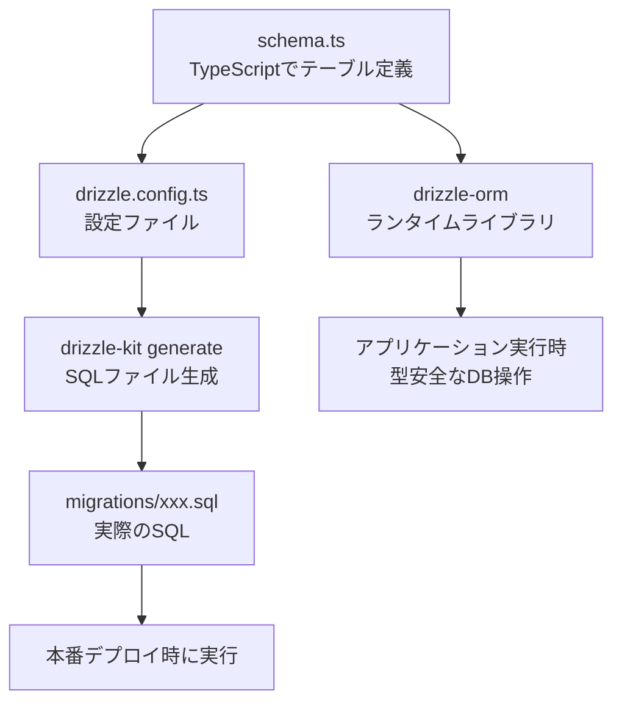
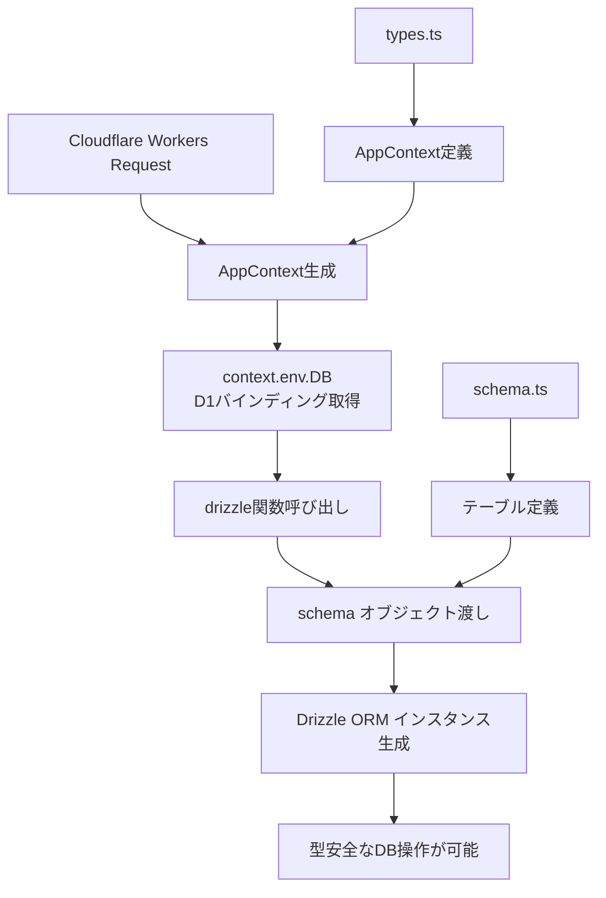
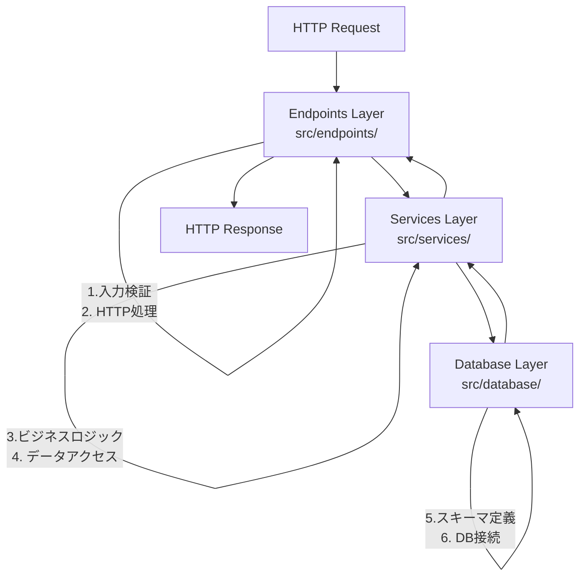

# データベース設計・実装フェーズ Q&A

## Q: 今回のデータベース設計・実装フェーズでの、実装の流れは？何から着手して、その理由は？

### A: 実装の流れと理由

#### 1. **Drizzle ORMセットアップ（最初に実施）**

**実装内容:**
- 依存関係の追加（`drizzle-orm`, `@cloudflare/d1`, `drizzle-kit`）
- `drizzle.config.ts` 設定ファイル作成
- package.json に DB管理スクリプト追加

**理由:**
- **環境構築が最優先**: コードを書く前に開発環境を整える
- **設定ファイルが基盤**: 後続のスキーマ生成やマイグレーションで必要
- **依存関係の確認**: 早期にライブラリの互換性をチェック

```bash
# 最初に実行したコマンド例
pnpm add drizzle-orm @cloudflare/d1
pnpm add -D drizzle-kit better-sqlite3
```

#### 2. **データベーススキーマ定義（2番目に実施）**

**実装内容:**
- `src/database/schema.ts` でテーブル構造定義
- users, todosテーブルの詳細設計
- 型定義の自動生成設定

**理由:**
- **設計を先にコード化**: 仕様書の内容を具体的なコードに落とし込む
- **型安全性の確保**: TypeScriptの恩恵を最大限活用
- **リレーション設計**: 外部キー制約やインデックスを明確に定義

```typescript
// schema.ts の重要な部分
export const users = sqliteTable('users', {
  id: text('id').primaryKey(), // Firebase UID
  email: text('email').notNull().unique(),
  // ...
});

export const todos = sqliteTable('todos', {
  id: text('id').primaryKey(),
  userId: text('user_id').notNull()
    .references(() => users.id, { onDelete: 'cascade' }), // 外部キー
  // ...
});
```

#### 3. **マイグレーション生成（3番目に実施）**

**実装内容:**
- `pnpm db:generate` でマイグレーションファイル自動生成
- SQLファイルの確認と検証

**理由:**
- **データベース構造の確定**: スキーマ定義が正しいかSQLレベルで確認
- **本番デプロイ準備**: 実際のデータベース作成に必要
- **バージョン管理**: データベースの変更履歴を残す

#### 4. **データベース接続層（4番目に実施）**

**実装内容:**
- `src/database/connection.ts` で接続ユーティリティ作成
- Cloudflare Workers環境での接続パターン実装

**理由:**
- **接続の抽象化**: 環境に依存しない接続方法を提供
- **エラーハンドリング**: D1バインディングの存在確認
- **型安全な接続**: Drizzle ORMインスタンスの適切な生成

```typescript
export function getDatabase(context: AppContext) {
  const d1Database = context.env.DB;
  if (!d1Database) {
    throw new Error('D1 database binding not found');
  }
  return drizzle(d1Database, { schema });
}
```

#### 5. **共通ユーティリティ（5番目に実施）**

**実装内容:**
- `src/utils/db.ts` でデータベース操作の共通処理
- ID生成、スラッグ生成、エラーハンドリング等

**理由:**
- **DRY原則**: 重複するコードを避ける
- **ビジネスロジック分離**: データベース固有の処理を集約
- **テストしやすさ**: 小さな関数単位でテスト可能

#### 6. **サービス層（6番目に実施）**

**実装内容:**
- `UserService`, `TodoService` クラス作成
- CRUD操作とビジネスロジック実装

**理由:**
- **責任の分離**: データベース操作とビジネスロジックを分離
- **再利用性**: 複数のエンドポイントから利用可能
- **テスト容易性**: ビジネスロジックを単独でテスト可能

#### 7. **エンドポイント更新（最後に実施）**

**実装内容:**
- 既存のモックエンドポイントを実DB操作に置換
- バリデーションとエラーハンドリング強化

**理由:**
- **段階的な置き換え**: 動作する機能を壊さずに改良
- **API仕様の維持**: フロントエンドへの影響を最小化
- **統合テスト**: 全体の流れを通して動作確認

### 💡 初学者へのポイント

#### なぜこの順序なのか？

1. **依存関係 → 設定 → 実装** の流れは鉄則
2. **下位レイヤーから上位レイヤー** へ（DB → サービス → API）
3. **具体的なものから抽象的なもの** へ（テーブル → ビジネスロジック）

#### 他のアプローチとの比較

❌ **悪い例: エンドポイントから先に実装**
```typescript
// 先にAPIを作ってしまう（推奨しない）
app.post('/api/todos', async (c) => {
  // データベースがないので何もできない...
  return c.json({ error: 'Not implemented' });
});
```

✅ **良い例: 基盤から順番に構築**
```typescript
// 1. スキーマ定義
export const todos = sqliteTable(/* ... */);

// 2. サービス層
export class TodoService {
  async createTodo(data) { /* 実装 */ }
}

// 3. エンドポイント
app.post('/api/todos', async (c) => {
  const service = new TodoService(getDatabase(c));
  return service.createTodo(data); // 既に実装済み
});
```

#### 学習のコツ

1. **一つずつ確実に**: 各段階で動作確認してから次へ
2. **型エラーを恐れない**: TypeScriptが教えてくれる設計の問題
3. **小さく始める**: 最小限の機能から徐々に拡張
4. **テストを書く**: 各レイヤーで単体テストを実装

---

## Q: `drizzle-orm`,`drizzle-kit`はそれぞれ何のために必要？`drizzle.config.ts`とは何？

### A: Drizzleエコシステムの役割分担

#### 1. **`drizzle-orm` - ランタイム（実行時）ライブラリ**

**役割:** アプリケーション実行時にデータベース操作を行う

**具体的な機能:**
- **クエリビルダー**: SQLを書かずにタイプセーフなクエリ作成
- **型安全性**: TypeScriptでデータベース操作の型チェック  
- **データベース接続**: 各種データベース（D1, PostgreSQL等）への接続

**使用例:**
```typescript
// drizzle-orm を使ったクエリ例
import { eq } from 'drizzle-orm';
import { todos } from './schema';

// SELECT * FROM todos WHERE user_id = 'user123'
const userTodos = await db
  .select()
  .from(todos)
  .where(eq(todos.userId, 'user123'));

// INSERT INTO todos (id, title, ...) VALUES (...)
const newTodo = await db
  .insert(todos)
  .values({ id: 'uuid', title: 'Buy milk', ... })
  .returning();
```

**なぜ必要？**
- 生のSQLを書く必要がない → **開発効率向上**
- TypeScriptの型チェック → **バグの事前発見**
- データベース間の差異を吸収 → **移植性向上**

#### 2. **`drizzle-kit` - 開発時ツール**

**役割:** 開発時にスキーマ管理とマイグレーションを支援

**具体的な機能:**
- **マイグレーション生成**: スキーマからSQLファイル自動生成
- **スキーマ検証**: 定義の整合性チェック
- **Drizzle Studio**: データベースのGUI管理ツール
- **プッシュ機能**: 開発環境への直接反映

**使用コマンド例:**
```bash
# マイグレーションファイル生成
pnpm db:generate
# ↓ 内部的には以下を実行
drizzle-kit generate

# Drizzle Studio（GUI）起動
pnpm db:studio
# ↓ 内部的には以下を実行  
drizzle-kit studio

# 開発環境にスキーマ直接適用
pnpm db:push
# ↓ 内部的には以下を実行
drizzle-kit push
```

**なぜ必要？**
- **マイグレーション自動化** → 手動SQLファイル作成が不要
- **開発体験向上** → GUIでデータベース確認可能
- **本番デプロイ準備** → 本番用SQLファイル生成

#### 3. **`drizzle.config.ts` - 設定ファイル**

**役割:** drizzle-kitがどのように動作するかを指定

**設定内容の詳細:**
```typescript
import { defineConfig } from 'drizzle-kit';

export default defineConfig({
  // スキーマファイルの場所
  schema: './src/database/schema.ts',
  
  // 生成されるマイグレーションファイルの出力先
  out: './migrations',
  
  // 使用するデータベース種類
  dialect: 'sqlite', // D1はSQLiteベース
  
  // データベース接続情報
  dbCredentials: {
    // ローカル開発用のSQLiteファイルパス
    url: './.wrangler/state/v3/d1/miniflare-D1DatabaseObject/xxx.sqlite',
  },
  
  // ログ出力レベル
  verbose: true,
  
  // 厳密なチェック有効化
  strict: true,
});
```

**各設定の意味:**

| 設定項目 | 意味 | 例 |
|---------|------|-----|
| `schema` | TypeScriptスキーマファイルの場所 | `./src/database/schema.ts` |
| `out` | SQLマイグレーションファイル出力先 | `./migrations` |
| `dialect` | データベースの種類 | `sqlite`（D1用）|
| `dbCredentials` | 接続情報 | ローカルファイルパス |
| `verbose` | 詳細ログ表示 | `true` |
| `strict` | 厳密チェック | `true` |

#### 4. **３つの連携フロー**



#### 5. **なぜこの構成なのか？**

**従来の問題点:**
```sql
-- 手動でSQLを書く（従来）
CREATE TABLE todos (
  id TEXT PRIMARY KEY,
  title TEXT NOT NULL,
  -- 型情報がTypeScriptと分離している
);
```

```typescript
// 型定義を別途手動で作成
interface Todo {
  id: string;
  title: string; // SQLと同期が取れていない可能性
}
```

**Drizzleの解決策:**
```typescript
// 1つのファイルで型とスキーマを定義
export const todos = sqliteTable('todos', {
  id: text('id').primaryKey(),
  title: text('title').notNull(),
});

// 型は自動生成される
export type Todo = typeof todos.$inferSelect; // ✅ 常に同期
```

#### 6. **実際の開発フロー**

1. **スキーマ定義** (`schema.ts`)
```typescript
export const todos = sqliteTable('todos', {
  id: text('id').primaryKey(),
  title: text('title').notNull(),
});
```

2. **マイグレーション生成** (`drizzle-kit`)
```bash
pnpm db:generate
# → migrations/0001_xxx.sql が生成される
```

3. **アプリケーションで使用** (`drizzle-orm`)
```typescript
import { todos } from './schema';
const allTodos = await db.select().from(todos);
```

### 💡 初学者へのポイント

#### よくある混乱

❓ **「なぜ2つのパッケージが必要なの？」**
→ **役割が違うから**
- `drizzle-orm`: アプリが動くときに使う（車のエンジン）
- `drizzle-kit`: 開発するときに使う（車の設計図作成ツール）

❓ **「設定ファイルって何を設定してるの？」**
→ **drizzle-kitに「どこを見て、どこに作るか」を教えている**
- どのファイルがスキーマか
- どこにSQLファイルを作るか
- どのデータベースを使うか

#### 学習の進め方

1. **まずは動かす**: 設定を真似して実際に動作させる
2. **設定を変更してみる**: `out`の場所を変えるとどうなるか試す
3. **エラーを経験する**: わざと間違った設定にしてエラーを理解
4. **他のプロジェクトと比較**: PostgreSQL用の設定などを見比べる

---

## Q: `sqliteTable`関数について、これは何をしている関数？

### A: `sqliteTable`関数の詳細解説

#### 1. **`sqliteTable`関数とは？**

**役割:** Drizzle ORMでSQLiteテーブルの構造を定義する関数

**基本構文:**
```typescript
import { sqliteTable, text, integer, index } from 'drizzle-orm/sqlite-core';

const テーブル名 = sqliteTable(
  'データベース上のテーブル名',
  {
    // カラム定義
  },
  (table) => ({
    // インデックス定義（オプション）
  })
);
```

#### 2. **3つのパラメータの詳細**

##### **第1パラメータ: テーブル名（文字列）**
```typescript
'users' // ← データベース上の実際のテーブル名
```
- **用途**: SQLで`CREATE TABLE users`として作成される
- **重要**: TypeScript変数名（`users`）とDB上のテーブル名（`'users'`）は別物
- **例**: 変数名を`userTable`にしても、DB上は`'users'`テーブルになる

##### **第2パラメータ: カラム定義（オブジェクト）**
```typescript
{
  /** Firebase UID（主キー） */
  id: text('id').primaryKey(),
  
  /** メールアドレス（一意制約） */
  email: text('email').notNull().unique(),
  
  /** 表示名（Firebase DisplayName由来） */
  displayName: text('display_name'),
  
  // ...
}
```

**各カラムの構成:**
- **キー名** (`id`, `email`): TypeScript上でアクセスする名前
- **カラム型関数** (`text`, `integer`, `boolean`): データ型指定
- **DB カラム名** (`'id'`, `'email'`, `'display_name'`): 実際のSQL上のカラム名  
- **制約メソッド** (`.primaryKey()`, `.notNull()`, `.unique()`): SQL制約

##### **第3パラメータ: インデックス定義（関数）**
```typescript
table => ({
  /** メールアドレスの一意インデックス */
  emailIdx: index('idx_users_email').on(table.email),
  
  /** 作成日時のインデックス（日付範囲検索用） */
  createdAtIdx: index('idx_users_created_at').on(table.createdAt),
})
```

**インデックスの構成:**
- **インデックス名** (`emailIdx`): TypeScript上の参照名
- **`index()`関数**: インデックス作成関数
- **DB インデックス名** (`'idx_users_email'`): SQL上のインデックス名
- **`.on()`メソッド**: インデックス対象カラム指定

#### 3. **生成されるSQLの例**

上記のスキーマ定義から、以下のSQLが自動生成されます：

```sql
-- テーブル作成
CREATE TABLE users (
  id TEXT PRIMARY KEY,
  email TEXT NOT NULL UNIQUE,
  display_name TEXT,
  created_at TEXT NOT NULL DEFAULT CURRENT_TIMESTAMP,
  updated_at TEXT NOT NULL DEFAULT CURRENT_TIMESTAMP
);

-- インデックス作成
CREATE INDEX idx_users_email ON users(email);
CREATE INDEX idx_users_created_at ON users(created_at);
```

#### 4. **なぜこの書き方なのか？**

##### **型安全性の確保**
```typescript
// ❌ 生SQLだと型チェックなし
db.query('SELECT * FROM users WHERE emial = ?', [email]); // typo!

// ✅ Drizzleだと型チェックあり
db.select().from(users).where(eq(users.email, email)); // emailのtypoは検出される
```

##### **スキーマとコードの同期**
```typescript
// スキーマ定義が変わると...
export const users = sqliteTable('users', {
  id: text('id').primaryKey(),
  email: text('email').notNull().unique(),
  fullName: text('full_name'), // displayName → fullName に変更
});

// 型も自動的に更新される
type User = typeof users.$inferSelect; // fullName プロパティに自動更新
```

##### **IntelliSenseとオートコンプリート**
- TypeScriptエディタで自動補完が効く
- 存在しないカラム名はコンパイルエラーになる
- リファクタリング時の一括変更が安全

#### 5. **実際の使用例**

##### **データ挿入**
```typescript
// TypeScriptオブジェクト → SQL INSERT
const newUser = await db.insert(users).values({
  id: 'firebase-uid-123',
  email: 'user@example.com',
  displayName: 'John Doe',
  // createdAt, updatedAt は自動設定される
}).returning();
```

##### **データ検索**
```typescript
// TypeScriptクエリ → SQL SELECT
const user = await db
  .select()
  .from(users)
  .where(eq(users.email, 'user@example.com'))
  .limit(1);

// user[0].displayName でアクセス可能（型安全）
```

##### **インデックスの効果確認**
```typescript
// このクエリは idx_users_email インデックスを使用
const userByEmail = await db
  .select()
  .from(users)
  .where(eq(users.email, target_email)); // 高速検索

// このクエリは idx_users_created_at インデックスを使用  
const recentUsers = await db
  .select()
  .from(users)
  .where(gte(users.createdAt, '2023-01-01'))
  .orderBy(desc(users.createdAt)); // 高速ソート
```

#### 6. **カラム型関数の種類**

| 関数 | SQLite型 | TypeScript型 | 用途 |
|------|---------|-------------|------|
| `text('name')` | TEXT | string | 文字列データ |
| `integer('age')` | INTEGER | number | 整数データ |
| `integer('flag', { mode: 'boolean' })` | INTEGER | boolean | 真偽値（0/1） |
| `real('price')` | REAL | number | 浮動小数点 |
| `blob('data')` | BLOB | Buffer | バイナリデータ |

#### 7. **制約メソッドの種類**

| メソッド | SQL制約 | 意味 |
|---------|---------|------|
| `.primaryKey()` | PRIMARY KEY | 主キー |
| `.notNull()` | NOT NULL | NULL不許可 |
| `.unique()` | UNIQUE | 一意制約 |
| `.default(value)` | DEFAULT value | デフォルト値 |
| `.references(() => other.id)` | FOREIGN KEY | 外部キー |

#### 8. **インデックス設計の考え方**

##### **なぜインデックスが必要？**
```typescript
// インデックスなし: 全テーブルスキャン（遅い）
SELECT * FROM users WHERE email = 'user@example.com'; -- O(n)

// インデックスあり: インデックス検索（高速）  
-- idx_users_email により O(log n) で検索可能
```

##### **インデックス設計のルール**
1. **WHERE句でよく使うカラム** → インデックス作成
2. **ORDER BY でよく使うカラム** → インデックス作成  
3. **複合検索** → 複合インデックス検討
4. **更新頻度の高いテーブル** → インデックス数を最小限に

```typescript
// 複合インデックスの例
userSlugIdx: index('idx_todos_user_slug').on(table.userId, table.slug),
// → WHERE user_id = ? AND slug = ? の検索が高速化
```

### 💡 初学者へのポイント

#### よくある間違い

❌ **カラム名とTypeScript名の混同**
```typescript
// 間違い: DB上のカラム名をTypeScriptで使おうとする
displayName: text('displayName'), // 'display_name' であるべき
```

✅ **正しい書き方**
```typescript
// 正しい: TypeScript名 ≠ DB名
displayName: text('display_name'), // TypeScript: displayName, DB: display_name
```

#### 学習のコツ

1. **小さく始める**: まず1つのテーブルから
2. **SQLを確認する**: `pnpm db:generate` で生成されるSQLを読む
3. **型を活用する**: `typeof users.$inferSelect` で型を確認
4. **インデックスを意識**: どのクエリが遅いかを考える

---

## Q: `connection.ts`の`drizzle`,`AppContext`,`schema`とはなに？

### A: データベース接続における3つの重要な要素

#### 1. **`drizzle` - Drizzle ORMのコンストラクタ関数**

**役割:** D1データベースをDrizzle ORMで使用可能にする関数

**インポート:**
```typescript
import { drizzle } from 'drizzle-orm/d1';
//        ↑ 関数名    ↑ D1専用パッケージ
```

**基本的な使い方:**
```typescript
// 基本形
const db = drizzle(d1Database);

// スキーマ付き（推奨）
const db = drizzle(d1Database, { schema });
```

**なぜこの関数が必要？**
- **D1とDrizzleの橋渡し**: CloudflareのD1をDrizzle ORMで操作可能にする
- **型安全性**: D1の生APIではなく、型安全なクエリビルダーを提供
- **スキーマ統合**: テーブル定義と実際のDB操作を連携

#### 2. **`AppContext` - アプリケーションコンテキスト型**

**定義:**
```typescript
// types.ts より
export interface Env {
  /** D1データベースバインディング */
  DB: D1Database;
  /** KVネームスペースバインディング */
  KV?: KVNamespace;
  /** Workers Secrets */
  FIREBASE_PROJECT_ID?: string;
}

export type AppContext = Context<{ Bindings: Env }>;
//                       ↑ HonoのContext型にカスタム環境を追加
```

**`AppContext`が含むもの:**

| プロパティ | 型 | 用途 |
|-----------|---|------|
| `context.env.DB` | D1Database | D1データベースへのアクセス |
| `context.env.KV` | KVNamespace | KVストレージへのアクセス |
| `context.env.FIREBASE_PROJECT_ID` | string | Firebase設定値 |
| `context.req` | HonoRequest | HTTPリクエスト情報 |
| `context.res` | HonoResponse | HTTPレスポンス操作 |

**なぜAppContextが必要？**
```typescript
// ❌ 直接D1にアクセスできない
const db = drizzle(??); // D1バインディングはどこから取得？

// ✅ AppContextからD1バインディングを取得
export function getDatabase(context: AppContext) {
  const d1Database = context.env.DB; // Cloudflareが自動注入
  return drizzle(d1Database, { schema });
}
```

#### 3. **`schema` - データベーススキーマ定義**

**インポート:**
```typescript
import * as schema from './schema';
//     ↑ 全エクスポートをschemaオブジェクトに集約
```

**`schema`の中身:**
```typescript
// schema.ts の全エクスポートが含まれる
schema = {
  users: sqliteTable('users', {...}),      // usersテーブル定義
  todos: sqliteTable('todos', {...}),      // todosテーブル定義
  User: typeof users.$inferSelect,          // User型
  NewUser: typeof users.$inferInsert,       // NewUser型
  Todo: typeof todos.$inferSelect,          // Todo型
  NewTodo: typeof todos.$inferInsert,       // NewTodo型
  // その他の型とテーブル定義...
}
```

**スキーマを渡す理由:**
```typescript
// スキーマなし: 基本的なクエリのみ
const db = drizzle(d1Database);
await db.run(sql`SELECT * FROM users`); // 生SQL必要

// スキーマあり: 型安全な操作が可能
const db = drizzle(d1Database, { schema });
await db.select().from(schema.users); // 型安全・オートコンプリート
```

#### 4. **3つの要素の連携フロー**



#### 5. **実際の動作例**

##### **リクエスト処理の流れ**
```typescript
// 1. エンドポイントでgetDatabase呼び出し
export class TaskList extends OpenAPIRoute {
  async handle(c: AppContext): Promise<Response> {
    // 2. AppContextからDB接続取得
    const db = getDatabase(c);
    //    ↓ 内部で実行される処理
    //    const d1Database = c.env.DB;        // AppContextからD1取得
    //    return drizzle(d1Database, { schema }); // drizzle関数でORM生成

    // 3. 型安全なクエリ実行
    const todos = await db.select().from(schema.todos);
    //                   ↑ schemaにより型安全・オートコンプリート

    return c.json({ success: true, data: todos });
  }
}
```

##### **各要素の役割分担**
```typescript
// drizzle: D1 → Drizzle ORM変換
const db = drizzle(d1Database, { schema });

// AppContext: Cloudflare環境からリソース取得  
const d1Database = context.env.DB;
const kvStorage = context.env.KV;

// schema: テーブル定義と型情報
const users = schema.users;   // テーブル定義
type User = schema.User;      // 型定義
```

#### 6. **Cloudflare特有の仕組み**

##### **D1バインディングとは？**
```toml
# wrangler.jsonc で設定
[[d1_databases]]
binding = "DB"           # ← context.env.DB でアクセス可能
database_name = "todo-db"
database_id = "xxx-xxx-xxx"
```

```typescript
// Workers実行時、Cloudflareが自動的に注入
context.env.DB           // ← D1Databaseインスタンスが利用可能
context.env.KV           // ← KVNamespaceインスタンスが利用可能
```

##### **環境による違い**
| 環境 | D1バインディング | 取得方法 |
|------|----------------|---------|
| **本番(Workers)** | Cloudflare管理 | `context.env.DB` |
| **ローカル** | wrangler dev | `context.env.DB` |
| **テスト** | better-sqlite3 | モック |

#### 7. **エラーハンドリングと設計思想**

##### **接続エラーの処理**
```typescript
export function getDatabase(context: AppContext) {
  const d1Database = context.env.DB;
  
  if (!d1Database) {
    throw new Error(
      'D1 database binding not found. ' +
      'wrangler.jsonc の d1_databases 設定を確認してください。'
    );
  }
  
  return drizzle(d1Database, { schema });
}
```

**エラーが発生するケース:**
- `wrangler.jsonc`でD1バインディング未設定
- データベース作成・バインディング忘れ
- 環境変数の設定ミス

##### **型安全性の設計**
```typescript
// 戻り値の型も明確に定義
export type Database = ReturnType<typeof getDatabase>;
//                     ↑ getDatabaseの戻り値型を自動推論

// サービス層で使用
export class TodoService {
  constructor(private db: Database) {} // ← 型安全な注入
  //                     ↑ getDatabaseの戻り値のみ受け入れ
}
```

#### 8. **他のDB環境との比較**

##### **PostgreSQL の場合**
```typescript
// PostgreSQL用の違い
import { drizzle } from 'drizzle-orm/postgres-js';
import postgres from 'postgres';

const client = postgres(connectionString);
const db = drizzle(client, { schema });
```

##### **MySQL の場合**
```typescript
// MySQL用の違い
import { drizzle } from 'drizzle-orm/mysql2';
import mysql from 'mysql2/promise';

const connection = await mysql.createConnection(config);
const db = drizzle(connection, { schema });
```

**D1の特徴:**
- **サーバーレス**: 接続プール不要
- **自動スケーリング**: 使用量に応じて自動拡張
- **グローバル配信**: エッジ分散データベース

### 💡 初学者へのポイント

#### よくある混乱

❓ **「なぜ3つも必要なの？」**
→ **役割分担があるから**
- `drizzle`: ORM機能提供（車のエンジン）
- `AppContext`: 環境リソース管理（燃料タンク）
- `schema`: テーブル設計図（設計書）

❓ **「AppContextって何が入ってるの？」**
→ **Cloudflareが自動注入する環境リソース**
```typescript
context.env.DB  // ← Cloudflareが自動で用意
context.req     // ← HTTPリクエスト情報
context.res     // ← HTTP レスポンス操作
```

#### デバッグのコツ

1. **バインディング確認**
```typescript
export function getDatabase(context: AppContext) {
  console.log('Available bindings:', Object.keys(context.env));
  // → ['DB', 'KV', 'FIREBASE_PROJECT_ID'] が表示されるはず
}
```

2. **スキーマ確認**
```typescript
console.log('Schema tables:', Object.keys(schema));
// → ['users', 'todos', 'User', 'Todo', ...] が表示されるはず
```

3. **DB接続テスト**
```typescript
const db = getDatabase(context);
const result = await db.run(sql`SELECT 1 as test`);
console.log('Connection test:', result);
```

#### 学習の進め方

1. **小さく確認**: まず接続だけ確認
2. **ログ出力**: `console.log`で各要素の中身を確認
3. **エラー体験**: わざとバインディングを外してエラーを理解
4. **他環境比較**: PostgreSQL等の設定と比べてみる

---

## Q: `utils/db.ts`の「スラッグ」とは？

### A: スラッグ（Slug）の概念と実装

#### 1. **スラッグとは？**

**定義:** URL用に最適化された、人間が読みやすい文字列識別子

**例:**
```javascript
// 元のタイトル
"買い物リストを作成する"

// 生成されるスラッグ  
"task"

// 英語タイトルの場合
"Create Shopping List" → "create-shopping-list"
```

**特徴:**
- **URL安全**: 特殊文字が含まれない
- **人間可読**: 内容が推測できる
- **一意性**: 同じスラッグは存在しない
- **SEO対応**: 検索エンジンに優しい

#### 2. **なぜスラッグが必要？**

##### **URLの問題解決**
```typescript
// ❌ UUIDだけだと何のTODOかわからない
GET /api/todos/550e8400-e29b-41d4-a716-446655440000

// ✅ スラッグがあると内容がわかる
GET /api/todos/create-shopping-list
GET /api/todos/task-1  // 日本語の場合
```

##### **ユーザビリティ向上**
```typescript
// URLを見るだけで内容が推測できる
/todos/learn-react        // React学習のTODO
/todos/buy-groceries      // 買い物のTODO
/todos/task-3             // 日本語タイトルのTODO
```

##### **SEO効果**
- 検索エンジンがURLから内容を理解
- ソーシャルメディアでのシェア時に意味のあるURL
- ブックマーク時の識別しやすさ

#### 3. **スラッグ生成のアルゴリズム**

```typescript
export function generateSlug(title: string, existingSlugs: string[] = []): string {
  // ステップ1: 基本変換
  let baseSlug = title
    .toLowerCase()                          // 小文字化
    .trim()                                // 前後の空白削除
    .replace(/[ひらがな・カタカナ・漢字]/g, 'task')  // 日本語 → "task"
    .replace(/[^a-z0-9-]/g, '-')           // 英数字とハイフン以外 → ハイフン
    .replace(/-+/g, '-')                   // 連続ハイフン → 単一ハイフン
    .replace(/^-|-$/g, '');                // 前後のハイフン削除

  // ステップ2: デフォルト値設定
  if (!baseSlug) {
    baseSlug = 'task';
  }

  // ステップ3: 長さ制限
  if (baseSlug.length > 50) {
    baseSlug = baseSlug.substring(0, 50).replace(/-$/, '');
  }

  // ステップ4: 重複チェックと連番付与
  let slug = baseSlug;
  let counter = 1;
  while (existingSlugs.includes(slug)) {
    slug = `${baseSlug}-${counter}`;
    counter++;
  }

  return slug;
}
```

#### 4. **変換の具体例**

##### **英語タイトルの変換**
| 元のタイトル | 変換過程 | 最終スラッグ |
|-------------|---------|-------------|
| "Buy Milk" | buy milk → buy-milk | `buy-milk` |
| "Learn React.js!!!" | learn react.js!!! → learn-react-js | `learn-react-js` |
| "Fix Bug #123" | fix bug #123 → fix-bug-123 | `fix-bug-123` |

##### **日本語タイトルの変換**
| 元のタイトル | 変換過程 | 最終スラッグ |
|-------------|---------|-------------|
| "買い物に行く" | 買い物に行く → task | `task` |
| "プロジェクト進捗確認" | プロジェクト進捗確認 → task | `task` |
| "Meeting資料作成" | meeting資料作成 → meeting-task | `meeting-task` |

##### **重複処理の例**
```typescript
// 既存のスラッグ: ['task', 'task-1', 'buy-milk']

generateSlug('牛乳を買う', ['task', 'task-1']);
// → 'task-2' (taskとtask-1は既に存在するため)

generateSlug('Buy Milk Again', ['buy-milk']);
// → 'buy-milk-1' (buy-milkは既に存在するため)
```

#### 5. **データベース設計での活用**

##### **テーブル構造**
```typescript
export const todos = sqliteTable('todos', {
  id: text('id').primaryKey(),           // UUID: 内部識別用
  slug: text('slug').notNull().unique(), // スラッグ: URL用
  title: text('title').notNull(),        // 元のタイトル
  // ...
});
```

##### **インデックス設計**
```typescript
// スラッグ検索を高速化
slugIdx: index('idx_todos_slug').on(table.slug),

// ユーザー別スラッグ検索を高速化  
userSlugIdx: index('idx_todos_user_slug').on(table.userId, table.slug),
```

#### 6. **API設計での使用**

##### **RESTfulなURL設計**
```typescript
// プライマリキー(UUID)でのアクセス
GET /api/todos/550e8400-e29b-41d4-a716-446655440000

// スラッグでのアクセス（推奨）
GET /api/todos/by-slug/create-shopping-list

// またはパスパラメータとして
GET /api/users/{userId}/todos/{slug}
```

##### **サービス層での実装**
```typescript
export class TodoService {
  // スラッグでTODO取得
  async getTodoBySlug(userId: string, slug: string): Promise<Todo | null> {
    const todos = await this.db
      .select()
      .from(schema.todos)
      .where(
        and(
          eq(schema.todos.userId, userId),
          eq(schema.todos.slug, slug),
          isNull(schema.todos.deletedAt)
        )
      )
      .limit(1);

    return todos[0] || null;
  }

  // TODO作成時のスラッグ生成
  async createTodo(userId: string, data: CreateTodo): Promise<Todo> {
    // 既存スラッグを取得
    const existingSlugs = await this.getExistingSlugs(userId);
    
    // スラッグ生成
    const slug = generateSlug(data.title, existingSlugs);
    
    // TODO作成
    const newTodo = await this.db
      .insert(schema.todos)
      .values({
        id: generateId(),
        userId,
        slug,          // ← 生成されたスラッグを保存
        title: data.title,
        // ...
      })
      .returning();

    return newTodo[0];
  }
}
```

#### 7. **スラッグの利点とトレードオフ**

##### **利点**
✅ **ユーザビリティ**: URLから内容が推測できる  
✅ **SEO効果**: 検索エンジンに優しい  
✅ **ブックマーク**: 意味のあるURLでブックマーク可能  
✅ **デバッグ**: ログやエラーメッセージで内容が分かる  

##### **トレードオフ**
❌ **ストレージ増加**: 追加のカラムが必要  
❌ **複雑性**: 重複チェック処理が必要  
❌ **パフォーマンス**: インデックスとクエリの追加  
❌ **国際化**: 日本語等の処理が困難  

#### 8. **実際の使用場面**

##### **フロントエンドでの活用**
```typescript
// React Routerでの使用例
<Route path="/todos/:slug" component={TodoDetail} />

// リンク生成
<Link to={`/todos/${todo.slug}`}>
  {todo.title}
</Link>

// パンくずリスト
<Breadcrumb>
  <BreadcrumbItem>Todos</BreadcrumbItem>
  <BreadcrumbItem>{todo.slug}</BreadcrumbItem>
</Breadcrumb>
```

##### **分析・ログでの活用**
```typescript
// アクセスログ
console.log(`TODO accessed: ${todo.slug} by user ${userId}`);

// 分析用データ
{
  event: 'todo_viewed',
  todo_slug: 'create-shopping-list',
  user_id: 'user123'
}
```

#### 9. **他の実装パターンとの比較**

##### **UUID only**
```typescript
// シンプルだが、URLが意味不明
GET /api/todos/550e8400-e29b-41d4-a716-446655440000
```

##### **Auto increment ID**
```typescript
// シンプルだが、順序が予測可能（セキュリティリスク）
GET /api/todos/123
GET /api/todos/124  // ← 次のTODOが推測できる
```

##### **UUID + Slug（推奨）**
```typescript
// セキュアで、かつ人間が読みやすい
GET /api/todos/create-shopping-list  // スラッグで検索
// 内部的にはUUIDで管理、スラッグは表示用
```

#### 10. **改善可能な点**

##### **日本語処理の改善案**
```typescript
// 現在の実装（簡易版）
.replace(/[ひらがな・カタカナ・漢字]/g, 'task')

// 改善案: 翻訳APIやローマ字変換
.replace(/買い物/g, 'shopping')
.replace(/タスク/g, 'task') 
// または外部ライブラリ使用
```

##### **スラッグ更新戦略**
```typescript
// タイトル更新時のスラッグ処理
async updateTodo(id: string, data: UpdateTodo) {
  // オプション1: スラッグは変更しない（URL安定性重視）
  // オプション2: 新しいスラッグを生成（内容反映重視）
  // オプション3: ユーザーに選択させる
}
```

### 💡 初学者へのポイント

#### よくある質問

❓ **「なぜUUIDだけじゃダメなの？」**
→ **人間が理解できないから**
- UUIDは機械的には完璧だが、URLが意味不明
- デバッグやログ確認時に内容が分からない
- ユーザーがURLを共有したときに不親切

❓ **「スラッグが重複したらどうなるの？」**
→ **自動的に連番が付く**
```typescript
'task' → 'task-1' → 'task-2' → ...
```

❓ **「日本語はなぜ"task"になるの？」**
→ **URL安全性のため**
- 日本語URLは技術的に可能だが、エンコードが複雑
- 古いシステムとの互換性問題
- 簡潔なスラッグの方が扱いやすい

#### 学習のコツ

1. **まず英語で試す**: 日本語の複雑さを避けて基本を理解
2. **重複を意図的に作る**: 連番機能の動作を確認  
3. **長いタイトルで試す**: 文字数制限の動作を確認
4. **特殊文字を含める**: サニタイゼーション処理を理解

---

## Q: エンドポイントとサービス層の関係は？

### A: 3層アーキテクチャによる責任分離設計

#### 1. **アーキテクチャ全体像**



**各層の役割:**
- **Endpoints層**: HTTP通信とAPI仕様の管理
- **Services層**: ビジネスロジックとドメイン操作
- **Database層**: データ永続化とスキーマ管理

#### 2. **Endpoints層の責任（`src/endpoints/`）**

**主な役割:**
- **HTTP プロトコル処理**: リクエスト/レスポンス、ステータスコード
- **API 契約管理**: OpenAPI スキーマ定義、ドキュメント生成
- **入力検証**: Zod によるクエリパラメータ・リクエストボディ検証
- **レスポンス整形**: 一貫したJSON レスポンス構造
- **エラー変換**: サービス層エラーを適切なHTTP レスポンスに変換

**実装例（TaskList エンドポイント）:**
```typescript
export class TaskList extends OpenAPIRoute {
  schema = {
    tags: ['Todos'],
    summary: 'TODO一覧取得',
    description: 'ユーザーのTODO一覧を取得します...',
    request: {
      query: z.object({
        page: Num({ description: 'ページ番号（0ベース）', default: 0 }),
        limit: Num({ description: '1ページあたりの件数', default: 20 }),
        completed: Bool({ description: '完了状態フィルタ', required: false }),
        // ... その他のパラメータ
      }),
    },
    responses: {
      '200': { description: 'TODO一覧取得成功', content: {...} },
      '400': { description: 'バリデーションエラー', content: {...} },
      '500': { description: 'サーバーエラー', content: {...} },
    },
  };

  async handle(c: AppContext): Promise<Response> {
    try {
      // 1. 入力検証とデータ取得
      const data = await this.getValidatedData<typeof this.schema>();
      const queryParams = data.query;

      // 2. サービス層の初期化
      const db = getDatabase(c);
      const todoService = new TodoService(db);

      // 3. ビジネスロジックをサービス層に委譲
      const result = await todoService.getTodos(
        queryParams.userId,
        { completed: queryParams.completed, search: queryParams.search },
        { field: queryParams.sortField, order: queryParams.sortOrder },
        { page: queryParams.page, limit: queryParams.limit }
      );

      // 4. HTTP レスポンス整形
      return c.json({ success: true, data: result });
    } catch (error) {
      // 5. エラーハンドリング（HTTP レベル）
      if (error instanceof z.ZodError) {
        return c.json({ success: false, error: 'バリデーションエラー' }, 400);
      }
      return c.json({ success: false, error: 'サーバーエラー' }, 500);
    }
  }
}
```

#### 3. **Services層の責任（`src/services/`）**

**主な役割:**
- **ビジネスロジック**: 複雑なドメイン操作、検証ルール、データ変換
- **データアクセス**: Drizzle ORM を使用したデータベースクエリ
- **ドメイン操作**: CRUD操作、フィルタリング、ソート、ページネーション
- **データ整合性**: 検証、制約チェック、エラーハンドリング
- **ユーザー認可**: ユーザーが自分のデータのみアクセス可能にする

**実装例（TodoService）:**
```typescript
export class TodoService {
  constructor(private db: Database) {} // 依存性注入

  /**
   * TODO一覧を取得する
   * 
   * フィルタリング、ソート、ページネーション機能を提供。
   * ユーザー認可とロジカル削除の除外も行う。
   */
  async getTodos(
    userId: string,
    filters: TodoFilters = {},
    sort: TodoSortOptions = { field: 'createdAt', order: 'desc' },
    pagination: PaginationOptions = { page: 0, limit: 20 }
  ): Promise<TodoListResponse> {
    // 1. クエリ条件の構築（ビジネスロジック）
    const whereConditions = [
      eq(schema.todos.userId, userId), // ユーザー認可
      isNull(schema.todos.deletedAt),  // ロジカル削除除外
    ];

    // 2. フィルタリング条件の追加
    if (filters.completed !== undefined) {
      whereConditions.push(eq(schema.todos.completed, filters.completed));
    }
    if (filters.search) {
      const searchPattern = normalizeSearchTerm(filters.search);
      whereConditions.push(
        or(
          like(schema.todos.title, searchPattern),
          like(schema.todos.description, searchPattern)
        )
      );
    }

    // 3. 総件数取得
    const [countResult] = await this.db
      .select({ count: count() })
      .from(schema.todos)
      .where(and(...whereConditions));

    // 4. データ取得（ソート・ページネーション適用）
    const todos = await this.db
      .select()
      .from(schema.todos)
      .where(and(...whereConditions))
      .orderBy(
        sort.order === 'desc' 
          ? desc(schema.todos[sort.field]) 
          : asc(schema.todos[sort.field])
      )
      .limit(pagination.limit)
      .offset(calculateOffset(pagination.page, pagination.limit));

    // 5. レスポンス形式に整形
    return {
      todos,
      total: countResult.count,
      page: pagination.page,
      limit: pagination.limit,
      totalPages: Math.ceil(countResult.count / pagination.limit),
    };
  }

  /**
   * TODO作成
   * タイトル検証、スラッグ生成、重複チェックを行う
   */
  async createTodo(userId: string, todoData: CreateTodo): Promise<Todo> {
    // 1. ビジネス検証
    if (!todoData.title?.trim()) {
      throw new Error('タイトルは必須です。');
    }
    if (!todoData.dueDate) {
      throw new Error('期限日は必須です。');
    }

    // 2. 既存スラッグ取得（重複チェック用）
    const existingSlugs = await this.getExistingSlugs(userId);

    // 3. ビジネスロジック（スラッグ生成）
    const slug = generateSlug(todoData.title, existingSlugs);

    // 4. データベース操作
    const newTodo = await this.db
      .insert(schema.todos)
      .values({
        id: generateId(),
        userId,
        slug,
        title: todoData.title.trim(),
        description: todoData.description?.trim() || null,
        completed: todoData.completed || false,
        dueDate: normalizeDate(todoData.dueDate),
        createdAt: getCurrentTimestamp(),
        updatedAt: getCurrentTimestamp(),
        deletedAt: null,
      })
      .returning();

    return newTodo[0];
  }
}
```

#### 4. **データフローと相互作用**

##### **リクエスト処理の流れ**
```typescript
// 1. HTTP Request (Endpoints 層)
POST /api/todos
Content-Type: application/json
{
  "title": "買い物リスト作成",
  "description": "週末の買い物準備",
  "dueDate": "2023-12-31T23:59:59.000Z"
}

// 2. エンドポイントでの処理
export class TaskCreate extends OpenAPIRoute {
  async handle(c: AppContext): Promise<Response> {
    // 2-1. 入力検証
    const data = await this.getValidatedData<typeof this.schema>();
    
    // 2-2. サービス初期化（依存性注入）
    const db = getDatabase(c);
    const todoService = new TodoService(db);
    
    // 2-3. ビジネスロジックに委譲
    const newTodo = await todoService.createTodo(data.query.userId, data.body);
    
    // 2-4. HTTP レスポンス整形
    return c.json({ success: true, data: newTodo }, 201);
  }
}

// 3. サービスでの処理
export class TodoService {
  async createTodo(userId: string, todoData: CreateTodo): Promise<Todo> {
    // 3-1. ビジネス検証
    this.validateTodoData(todoData);
    
    // 3-2. ビジネスロジック実行
    const slug = generateSlug(todoData.title, await this.getExistingSlugs(userId));
    
    // 3-3. データベース操作
    return await this.db.insert(schema.todos).values({...}).returning();
  }
}

// 4. HTTP Response (自動生成)
HTTP/1.1 201 Created
Content-Type: application/json
{
  "success": true,
  "data": {
    "id": "uuid-generated",
    "slug": "task",
    "title": "買い物リスト作成",
    "description": "週末の買い物準備",
    // ...
  }
}
```

##### **エラーハンドリングの流れ**
```typescript
// Database Error → Service Error → HTTP Error

// 1. データベースレベルのエラー
// UNIQUE constraint failed: todos.slug

// 2. サービス層でのエラー処理
catch (error) {
  const userMessage = handleDatabaseError(error);
  throw new Error(userMessage); // ドメインエラーに変換
}

// 3. エンドポイント層でのエラー処理  
catch (error) {
  if (error.message.includes('既に存在')) {
    return c.json({ success: false, error: error.message }, 409); // Conflict
  }
  return c.json({ success: false, error: 'サーバーエラー' }, 500);
}
```

#### 5. **設計パターンと原則**

##### **1. 依存性注入パターン**
```typescript
// サービス層: データベース接続を注入で受け取る
export class TodoService {
  constructor(private db: Database) {} // 注入される依存性
}

// エンドポイント層: 依存性を注入
const db = getDatabase(c);           // コンテキストからDB取得
const todoService = new TodoService(db); // 依存性注入
```

**利点:**
- **テスタビリティ**: モックデータベースで簡単にテスト可能
- **疎結合**: 層間の結合度を低減
- **設定の柔軟性**: 環境に応じた設定変更が容易

##### **2. リポジトリパターン（暗黙的）**
```typescript
// サービスがリポジトリとして機能
export class TodoService {
  async getTodoById(userId: string, todoId: string): Promise<Todo | null>
  async createTodo(userId: string, todoData: CreateTodo): Promise<Todo>
  async updateTodo(userId: string, todoId: string, updateData: UpdateTodo): Promise<Todo>
  async deleteTodo(userId: string, todoId: string): Promise<boolean>
}
```

##### **3. ドメイン駆動設計の原則**
- **集約ルート**: `TodoService` が Todo 集約を管理
- **値オブジェクト**: `TodoFilters`, `TodoSortOptions`, `PaginationOptions`
- **ドメイン検証**: ビジネスルールをサービス層で実施

##### **4. OpenAPI スキーマファースト設計**
```typescript
// スキーマ定義が検証とドキュメント生成を両立
schema = {
  request: {
    query: z.object({
      page: Num({ description: 'ページ番号（0ベース）', default: 0 }),
      // Zodスキーマ → 自動検証 & OpenAPIドキュメント生成
    })
  },
  responses: {
    '200': { description: 'TODO一覧取得成功', content: {...} }
    // レスポンススキーマ → 自動ドキュメント生成
  }
};
```

#### 6. **アーキテクチャの利点**

##### **1. 関心の分離**
- **エンドポイント**: HTTP プロトコルと API 契約に専念
- **サービス**: ビジネスロジックとデータ操作に専念  
- **データベース**: データ永続化とリレーションに専念

##### **2. テスタビリティ**
```typescript
// サービス層を独立してテスト可能
describe('TodoService', () => {
  let todoService: TodoService;
  const mockDb = createMockDatabase();

  beforeEach(() => {
    todoService = new TodoService(mockDb); // モック注入
  });

  it('TODO一覧を正常に取得できる', async () => {
    const result = await todoService.getTodos('user-123');
    expect(result.todos).toHaveLength(2);
  });
});
```

##### **3. 再利用性**
- サービスは複数のエンドポイントから利用可能
- ビジネスロジックが一元化され一貫性を保つ
- 新しいAPI バージョンやインターフェースの追加が容易

##### **4. 保守性**
- ビジネスロジックの変更はサービス層のみに影響
- HTTP 関連の変更はエンドポイント層のみに影響
- 明確な境界によりデバッグが容易

##### **5. 型安全性**
```typescript
// データベースからHTTP レスポンスまで型安全性を保証
Database Schema → Service Types → Endpoint Validation → HTTP Response
     ↓              ↓              ↓                 ↓
  Drizzle Types → Todo型定義 → Zod Schema → JSON Response
```

##### **6. 自動ドキュメント生成**
- OpenAPI スキーマから API ドキュメント自動生成
- JSDoc による包括的なコード説明
- 層間の明確なインターフェース定義

#### 7. **実装時の考慮事項**

##### **設計原則の遵守**
1. **単一責任原則**: 各層が明確な目的を持つ
2. **依存性逆転原則**: 上位モジュールが下位モジュールに依存しない
3. **開放閉鎖原則**: 新機能の追加が容易
4. **インターフェース分離原則**: 層間のインターフェースが焦点化
5. **DRY原則**: ビジネスロジックがサービス層に集約
6. **フェイルファスト**: エンドポイント層で入力検証、サービス層でビジネス検証

**この設計により、スケーラブルで保守しやすい、明確な責任分離を持つバックエンドシステムが実現されています。**

---

*次回: テスト戦略と品質保証のアプローチについて詳しく解説します*