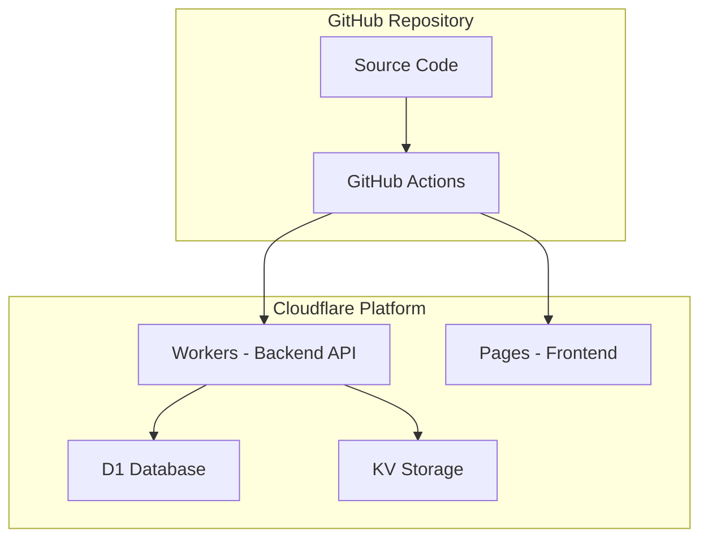
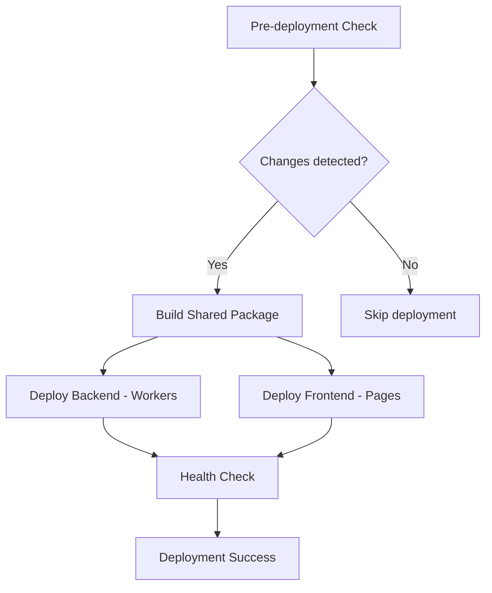

# Cloudflare デプロイメントガイド

## 概要

このドキュメントは、Cloudflare Todo Sample アプリケーションをCloudflare Workers（バックエンド）とCloudflare Pages（フロントエンド）にデプロイするための完全なガイドです。

GitHub ActionsによるCI/CDパイプラインを使用した自動デプロイの設定から実行まで、ステップバイステップで説明します。

## アーキテクチャ概要



**デプロイ対象:**
- **Backend**: Cloudflare Workers (Hono API + Firebase認証)
- **Frontend**: Cloudflare Pages (React静的サイト)
- **Database**: D1 Database (既存)
- **Cache**: KV Storage (JWT公開鍵キャッシュ)

## ⚠️ 重要: 環境変数チェックリスト

デプロイ前に以下の環境変数が**必ず**設定されていることを確認してください：

### 必須環境変数 (GitHub Secrets)

#### バックエンド用
- `CLOUDFLARE_API_TOKEN` - Cloudflare API Token (Workers編集権限)
- `CLOUDFLARE_ACCOUNT_ID` - CloudflareアカウントID

#### フロントエンド用
- `VITE_API_BASE_URL` - バックエンドWorkers URL（例：`https://backend.your-subdomain.workers.dev`）
- `VITE_FIREBASE_API_KEY` - Firebase API Key
- `VITE_FIREBASE_AUTH_DOMAIN` - Firebase Auth Domain
- `VITE_FIREBASE_PROJECT_ID` - Firebase Project ID
- `VITE_FIREBASE_STORAGE_BUCKET` - Firebase Storage Bucket
- `VITE_FIREBASE_MESSAGING_SENDER_ID` - Firebase Messaging Sender ID
- `VITE_FIREBASE_APP_ID` - Firebase App ID

### 📋 デプロイ前確認チェックリスト

- [ ] GitHub Secretsに上記すべての環境変数が設定済み
- [ ] `VITE_API_BASE_URL`の値にWorkers URLが正しく設定済み（末尾スラッシュなし）
- [ ] バックエンドWorkerが手動デプロイで動作確認済み
- [ ] Firebase設定値がプロジェクト設定と一致している
- [ ] CI/CDパイプラインが正常に実行される

> 💡 **重要**: `VITE_API_BASE_URL`が未設定の場合、本番環境でも`localhost:8787`にアクセスしてCORSエラーが発生します。

## Phase 1: 事前準備

### 1.1 Cloudflare API Token作成

#### Workers用APIトークン作成
1. **Cloudflareダッシュボード**にログイン
   - URL: https://dash.cloudflare.com

2. **My Profile** > **API Tokens** をクリック

3. **Create Token** > **Edit Cloudflare Workers** > **Use Template**

4. **Token名**を設定（例：`cloudflare-todo-sample-deploy`）

5. **Permissions**を確認・カスタマイズ:
   ```
   Account - Cloudflare Workers:Edit
   Account - Workers KV Storage:Edit  
   Account - Cloudflare Pages:Edit
   Zone - Zone Settings:Read (必要に応じて)
   ```

6. **Account Resources**: 使用するアカウントに制限

7. **Zone Resources**: 
   - カスタムドメイン使用時: 該当ゾーンを選択
   - 使用しない場合: "All zones from account"

8. **IP Address Filtering**（オプション）:
   - セキュリティ強化のため、CI/CD IPアドレスに制限可能

9. **TTL**: デフォルト（推奨）またはセキュリティポリシーに応じて設定

10. **Continue to summary** > **Create Token**

11. **生成されたトークンをコピー**（一度だけ表示）

#### APIトークン権限詳細
```yaml
必須権限:
  - Workers Scripts:Edit          # Workersデプロイ用
  - Workers KV Storage:Edit       # KV Namespaceアクセス用
  - Cloudflare Pages:Edit         # Pagesデプロイ用

オプション権限:
  - Zone Settings:Read            # カスタムドメイン設定用
  - Zone:Read                     # ゾーン情報取得用
```

### 1.2 Cloudflare Account ID取得

1. Cloudflareダッシュボード右サイドバーで **Account ID** を確認
2. コピーボタンでIDをコピー

### 1.3 GitHub Repository Secrets設定

#### 必須Secrets設定
1. **GitHubリポジトリ** > **Settings** > **Secrets and variables** > **Actions**

2. **New repository secret** で以下を追加:

   **CLOUDFLARE_API_TOKEN**
   ```
   Name: CLOUDFLARE_API_TOKEN
   Secret: [上記で作成したAPIトークン]
   ```

   **CLOUDFLARE_ACCOUNT_ID**
   ```
   Name: CLOUDFLARE_ACCOUNT_ID  
   Secret: [取得したAccount ID]
   ```

#### Secrets検証
```bash
# 設定確認（値は表示されません）
Repository Settings > Secrets and variables > Actions
✓ CLOUDFLARE_API_TOKEN: Set
✓ CLOUDFLARE_ACCOUNT_ID: Set
```

### 1.4 GitHub Environment設定

#### Production環境作成
1. **Settings** > **Environments** > **New environment**

2. **Environment name**: `production`

3. **Deployment branches and tags**:
   - **Selected branches and tags** を選択
   - **Add deployment branch or tag rule**
   - **Branch name pattern**: `main`
   - **Add rule**

4. **Required reviewers**（本番運用時推奨）:
   - 個人開発: 不要
   - チーム開発: 承認者を追加

5. **Wait timer**: `0` (即座にデプロイ)

#### Environment保護効果
- `main`ブランチのみproduction環境にデプロイ可能
- 他ブランチからの誤った本番デプロイを防止
- デプロイ履歴とログの環境別管理

## Phase 2: Cloudflareリソース準備

### 2.1 既存リソース確認

#### D1 Database
```bash
# 現在の設定確認
wrangler d1 list
```

**現在の設定:**
- Database名: `todo-app-db`
- Database ID: `07aab756-fe4a-4042-9e12-177b680ed67d`
- Status: 運用中

#### KV Namespace
```bash
# 現在の設定確認  
wrangler kv namespace list
```

**現在の設定:**
- Binding: `JWT_CACHE`
- Namespace ID: `a9500f6c3127441b94e29a15f4fa7bb0`
- Preview ID: `4d9b8ee3bfb04fbb92f9fb1c09adc173`

### 2.2 Cloudflare Pages プロジェクト作成

#### CLI作成（推奨）
```bash
# Pages プロジェクト作成
wrangler pages project create cloudflare-todo-sample-frontend

# 作成後の確認
wrangler pages project list
```

#### Web UI作成（代替方法）
1. **Cloudflareダッシュボード** > **Workers & Pages**
2. **Create application** > **Pages** > **Direct Upload**
3. **Project name**: `cloudflare-todo-sample-frontend`
4. **Production branch**: `main`
5. **Build settings**: 自動検出（React/Vite）

### 2.3 Workers設定確認

#### 現在のWorkers設定
```jsonc
// packages/backend/wrangler.jsonc
{
  "name": "backend",
  "main": "src/index.ts", 
  "compatibility_date": "2025-07-22",
  
  // リソースバインディング
  "d1_databases": [{
    "binding": "DB",
    "database_name": "todo-app-db",
    "database_id": "07aab756-fe4a-4042-9e12-177b680ed67d"
  }],
  
  "kv_namespaces": [{
    "binding": "JWT_CACHE", 
    "id": "a9500f6c3127441b94e29a15f4fa7bb0"
  }]
}
```

## Phase 3: CI/CDパイプライン詳細

### 3.1 CI Pipeline (.github/workflows/ci.yml)

#### 品質チェック戦略
```yaml
strategy:
  fail-fast: false
  matrix:
    package: [backend, shared, frontend]
```

**並列実行される品質チェック:**
1. **ESLint**: コード品質・スタイルチェック
2. **TypeScript**: 型安全性チェック  
3. **Vitest**: ユニットテスト実行

#### 統合チェック
- Wrangler開発サーバー起動テスト
- プロジェクト全体のビルド確認

### 3.2 CD Pipeline (.github/workflows/deploy.yml)

#### トリガー条件
```yaml
on:
  push:
    branches: [main]        # mainブランチへのpush
  workflow_dispatch:        # 手動実行
    inputs:
      environment:
        type: choice
        options: [production, staging]
```

#### デプロイフロー


#### 詳細ステップ

**1. Pre-deployment Check**
```yaml
# 変更検知とデプロイ要否判定
- git diff --name-only HEAD^ HEAD | grep -E "(packages/|\.github/)"
```

**2. Shared Package Build**
```yaml
# 共通パッケージビルド・キャッシュ
- pnpm --filter=@cloudflare-todo-sample/shared build
- uses: actions/cache@v4 # ビルド結果キャッシュ
```

**3. Backend Deployment**
```yaml
# Cloudflare Workers デプロイ
- uses: cloudflare/wrangler-action@v3
  with:
    apiToken: ${{ secrets.CLOUDFLARE_API_TOKEN }}
    workingDirectory: packages/backend
    command: deploy --env production
```

**4. Frontend Deployment**
```yaml
# Cloudflare Pages デプロイ
- uses: cloudflare/wrangler-action@v3
  with:
    apiToken: ${{ secrets.CLOUDFLARE_API_TOKEN }}
    workingDirectory: packages/frontend
    command: pages deploy dist --project-name=cloudflare-todo-sample-frontend
```

**5. Health Check**
```yaml
# デプロイ後の動作確認（将来実装）
# - Backend API health endpoint
# - Frontend accessibility check
```

## Phase 4: デプロイ実行

### 4.1 手動デプロイテスト

#### GitHub Actions手動実行
1. **GitHub Repository** > **Actions**タブ

2. **Deploy to Cloudflare** ワークフローを選択

3. **Run workflow** > **Use workflow from** > `main`

4. **Environment**: `production` を選択

5. **Run workflow** ボタンをクリック

#### 実行状況確認
```yaml
実行ログ確認項目:
✓ Pre-deployment check passed
✓ Shared package build completed  
✓ Backend deployment successful
✓ Frontend deployment successful
✓ Health checks passed
```

### 4.2 自動デプロイテスト

#### mainブランチへのマージ
```bash
# 現在のブランチ確認
git branch

# mainブランチに切り替え（または直接push）
git checkout main
git merge feature/issue-12-minimal-frontend-cicd
git push origin main
```

#### デプロイ自動実行確認
1. pushと同時にCD pipelineが自動実行
2. **Actions**タブでリアルタイム進捗確認
3. 各ステップのログとエラー確認

### 4.3 デプロイ結果確認

#### Backend (Cloudflare Workers)
```bash
# Workers URL確認
wrangler whoami  # account info
wrangler deployments list --name backend

# API動作確認
curl https://backend.[account-subdomain].workers.dev/api/health
```

#### Frontend (Cloudflare Pages)
```bash
# Pages URL確認  
wrangler pages project list

# サイト動作確認
curl https://cloudflare-todo-sample-frontend.pages.dev
```

#### リソース連携確認
```bash
# D1 Database接続確認
wrangler d1 execute todo-app-db --command "SELECT COUNT(*) FROM users;"

# KV Storage確認  
wrangler kv key list --namespace-id a9500f6c3127441b94e29a15f4fa7bb0
```

## Phase 5: 本番運用

### 5.1 カスタムドメイン設定（オプション）

#### Workersカスタムドメイン
```bash
# カスタムドメイン設定
wrangler publish --routes "api.yourdomain.com/*"
```

#### Pagesカスタムドメイン
1. **Cloudflare Dashboard** > **Workers & Pages** > プロジェクト選択
2. **Custom domains** > **Set up a custom domain**
3. ドメイン入力・DNS設定

### 5.2 環境変数・シークレット管理

#### Workers Secrets
```bash
# 本番用Firebase設定
wrangler secret put FIREBASE_PROJECT_ID
wrangler secret put FIREBASE_PRIVATE_KEY

# シークレット一覧確認
wrangler secret list
```

#### 環境別設定
```jsonc
// wrangler.jsonc - 環境別設定例
{
  "env": {
    "production": {
      "vars": {
        "ENVIRONMENT": "production",
        "API_BASE_URL": "https://api.yourdomain.com"
      }
    },
    "staging": {
      "vars": {
        "ENVIRONMENT": "staging", 
        "API_BASE_URL": "https://staging-api.yourdomain.com"
      }
    }
  }
}
```

### 5.3 監視・ログ設定

#### Cloudflare Analytics
- **Workers Analytics**: リクエスト数・レスポンス時間
- **Pages Analytics**: ページビュー・パフォーマンス
- **D1 Analytics**: クエリ実行統計

#### ログ監視
```bash
# リアルタイムログ
wrangler tail backend

# エラーログ確認
wrangler logs backend --format json
```

## トラブルシューティング

### よくある問題と解決方法

#### デプロイエラー

**API Token権限不足**
```
Error: Authentication error [Code: 10000]
```
→ APIトークンの権限とAccount ID設定を確認

**Resource not found**
```
Error: D1 database not found
```
→ wrangler.jsonc のresource IDと実際のIDが一致するか確認

**Build failure**
```
Error: Build failed with exit code 1
```
→ ローカルでのビルド成功を確認後、依存関係・環境変数をチェック

#### 認証エラー

**Firebase JWT検証失敗**
```
Error: Invalid JWT token
```
→ FIREBASE_PROJECT_ID設定とKV Namespaceの権限を確認

**CORS エラー**
```
Access to fetch blocked by CORS policy
```
→ Workers の CORS設定とフロントエンドのAPI URLを確認

#### パフォーマンス問題

**Cold Start遅延**
- Workers の初回実行遅延は正常
- 本番運用では定期的なヘルスチェックで解決

**D1接続タイムアウト**
- クエリの最適化
- 接続プール設定の確認

### ログ・デバッグ

#### GitHub Actions ログ
```yaml
# デプロイステップの詳細ログ確認
Actions > Deploy to Cloudflare > 各job展開
- Pre-deployment check
- Build shared package  
- Deploy backend (Workers)
- Deploy frontend (Pages)
- Post-deployment health check
```

#### Cloudflare ログ
```bash
# Workers リアルタイムログ
wrangler tail backend --format pretty

# Pages デプロイログ
wrangler pages deployment list --project-name cloudflare-todo-sample-frontend
```

## セキュリティ考慮事項

### API Token管理
- **最小権限の原則**: 必要最小限の権限のみ付与
- **定期ローテーション**: 3-6ヶ月でトークン更新
- **環境分離**: production/staging別トークン

### シークレット管理
- **GitHub Secrets**: APIトークン・認証キー
- **Workers Secrets**: Firebase設定・APIキー
- **環境変数**: 非機密設定値

### アクセス制御
- **Environment保護**: main ブランチのみproduction
- **IP制限**: 必要に応じてCI/CD IPアドレス制限
- **HTTPS強制**: 全通信の暗号化

## 次のステップ

Phase 4完了後の発展的な実装：

1. **Phase 5: フル機能実装**
   - Firebase認証UI
   - Todo管理画面
   - リアルタイム同期

2. **運用強化**
   - 監視・アラート設定
   - パフォーマンス最適化
   - A/Bテスト環境

3. **セキュリティ強化**
   - WAF設定
   - Rate Limiting
   - セキュリティヘッダー

---

このガイドに沿って設定することで、Cloudflare Todo Sample アプリケーションの完全な自動デプロイ環境が構築されます。