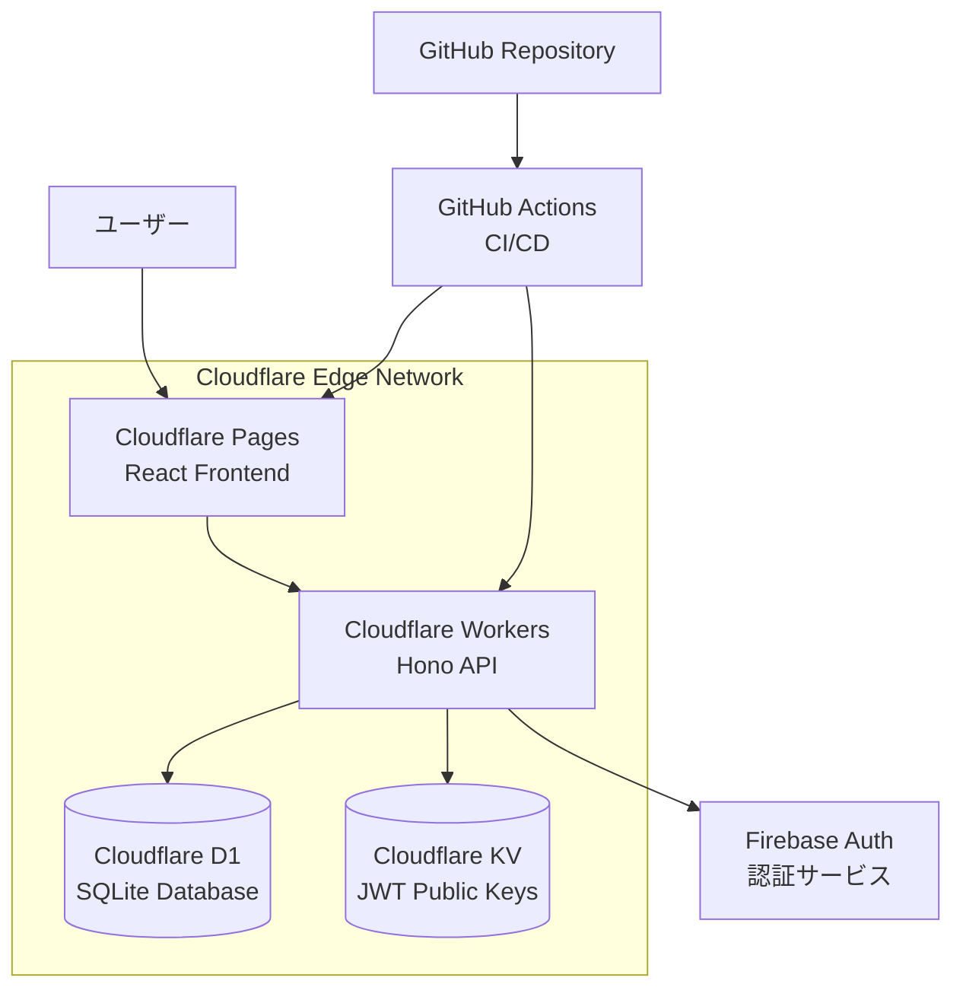
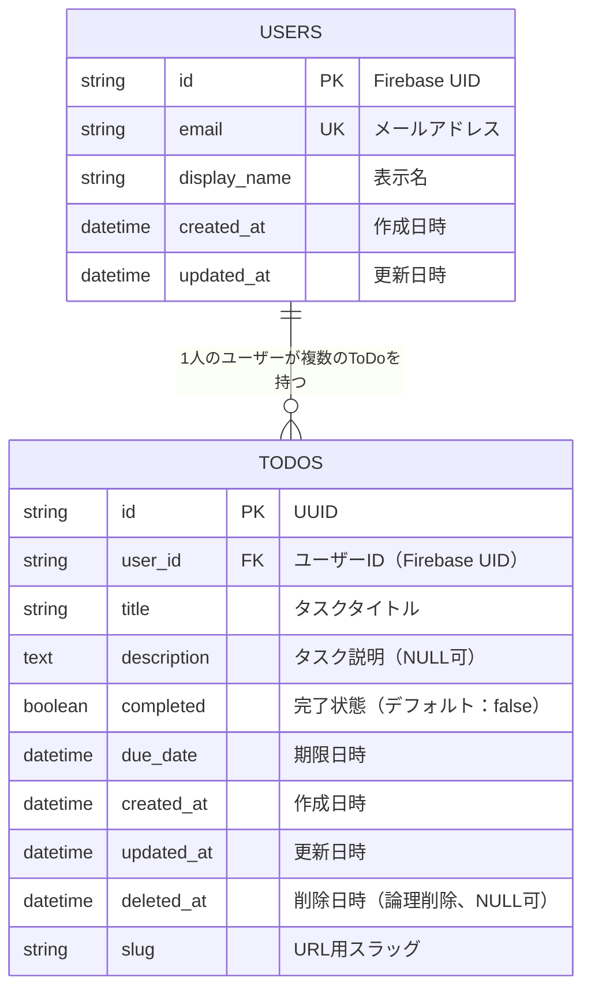
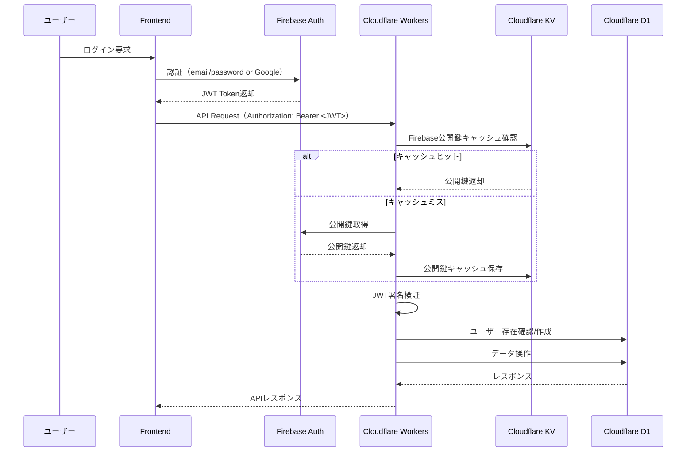
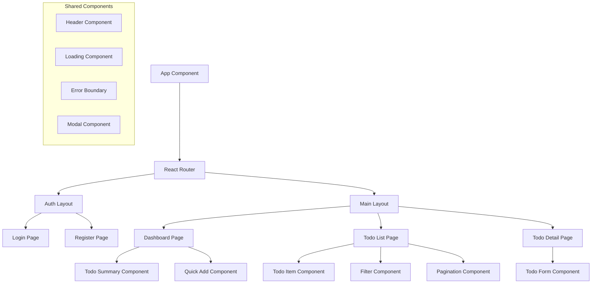
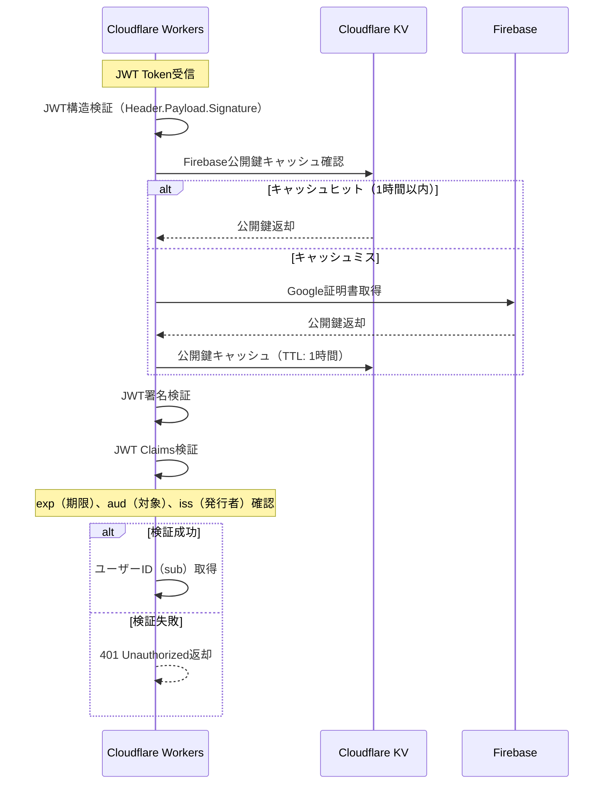
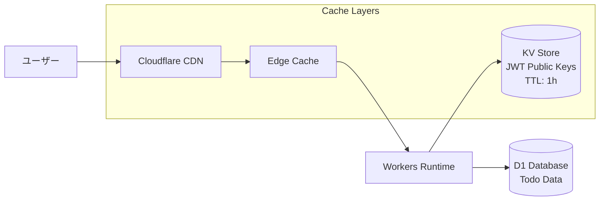
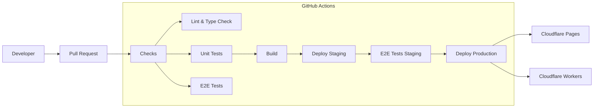

# システム設計書

## システムアーキテクチャ概要

### 全体アーキテクチャ図



## データベース設計

### ER図



### テーブル設計詳細

#### USERSテーブル
```sql
CREATE TABLE users (
    id TEXT PRIMARY KEY,              -- Firebase UID
    email TEXT UNIQUE NOT NULL,       -- メールアドレス
    display_name TEXT,                -- 表示名（Firebase DisplayName）
    created_at DATETIME DEFAULT CURRENT_TIMESTAMP,
    updated_at DATETIME DEFAULT CURRENT_TIMESTAMP
);

-- インデックス
CREATE UNIQUE INDEX idx_users_email ON users(email);
CREATE INDEX idx_users_created_at ON users(created_at);
```

#### TODOSテーブル
```sql
CREATE TABLE todos (
    id TEXT PRIMARY KEY,              -- UUID
    user_id TEXT NOT NULL,            -- Firebase UID
    title TEXT NOT NULL,              -- タスクタイトル
    description TEXT,                 -- タスク説明
    completed BOOLEAN DEFAULT FALSE,  -- 完了状態
    due_date DATETIME NOT NULL,       -- 期限日時
    created_at DATETIME DEFAULT CURRENT_TIMESTAMP,
    updated_at DATETIME DEFAULT CURRENT_TIMESTAMP,
    deleted_at DATETIME,              -- 論理削除用
    slug TEXT NOT NULL,               -- URL用スラッグ
    
    FOREIGN KEY (user_id) REFERENCES users(id) ON DELETE CASCADE
);

-- インデックス
CREATE INDEX idx_todos_user_id ON todos(user_id);
CREATE INDEX idx_todos_completed ON todos(completed);
CREATE INDEX idx_todos_due_date ON todos(due_date);
CREATE INDEX idx_todos_created_at ON todos(created_at);
CREATE INDEX idx_todos_deleted_at ON todos(deleted_at);
CREATE UNIQUE INDEX idx_todos_slug ON todos(slug);
CREATE INDEX idx_todos_user_slug ON todos(user_id, slug);
```

## API設計

### 認証フロー



### REST API仕様

#### 認証エンドポイント

```typescript
// POST /api/auth/verify
// JWT認証確認・ユーザー情報取得
interface AuthVerifyRequest {
  // Authorization Header: Bearer <JWT>
}

interface AuthVerifyResponse {
  user: {
    id: string;        // Firebase UID
    email: string;
    displayName: string;
  };
}
```

#### ToDoエンドポイント

```typescript
// GET /api/todos
interface TodoListRequest {
  page?: number;           // ページ番号（デフォルト：1）
  limit?: number;          // 取得件数（デフォルト：20、最大：100）
  completed?: boolean;     // 完了状態フィルタ
  due_before?: string;     // 期限日前フィルタ（ISO 8601）
  due_after?: string;      // 期限日後フィルタ（ISO 8601）
  sort?: 'created_at' | 'due_date' | 'title'; // ソート項目
  order?: 'asc' | 'desc';  // ソート順
}

interface TodoListResponse {
  todos: Todo[];
  pagination: {
    page: number;
    limit: number;
    total: number;
    totalPages: number;
  };
}

// POST /api/todos
interface TodoCreateRequest {
  title: string;
  description?: string;
  due_date: string;        // ISO 8601形式
}

// GET /api/todos/:slug
interface TodoFetchResponse {
  todo: Todo;
}

// PUT /api/todos/:slug
interface TodoUpdateRequest {
  title?: string;
  description?: string;
  completed?: boolean;
  due_date?: string;       // ISO 8601形式
}

// DELETE /api/todos/:slug
interface TodoDeleteResponse {
  message: string;
}

// 共通Todo型
interface Todo {
  id: string;
  user_id: string;
  title: string;
  description: string | null;
  completed: boolean;
  due_date: string;        // ISO 8601形式
  created_at: string;      // ISO 8601形式
  updated_at: string;      // ISO 8601形式
  slug: string;
}
```

## フロントエンド設計

### コンポーネント構成



### 状態管理設計

```typescript
// React Context + useReducer による状態管理

interface AppState {
  auth: {
    user: User | null;
    isLoading: boolean;
    error: string | null;
  };
  todos: {
    items: Todo[];
    isLoading: boolean;
    error: string | null;
    pagination: Pagination;
    filters: TodoFilters;
  };
}

interface User {
  id: string;
  email: string;
  displayName: string;
}

interface Pagination {
  page: number;
  limit: number;
  total: number;
  totalPages: number;
}

interface TodoFilters {
  completed?: boolean;
  due_before?: string;
  due_after?: string;
  sort: 'created_at' | 'due_date' | 'title';
  order: 'asc' | 'desc';
}
```

## セキュリティ設計

### JWT認証フロー詳細



### セキュリティ要件

#### JWT検証必須項目
- **署名検証**: Firebase公開鍵による署名検証
- **期限確認**: `exp` claim で有効期限確認
- **発行者確認**: `iss` claim でFirebase発行者確認
- **対象確認**: `aud` claim でプロジェクトID確認

#### CORS設定
```typescript
const corsOptions = {
  origin: [
    'http://localhost:3000',                    // 開発環境
    'https://your-app.pages.dev'               // 本番環境
  ],
  credentials: true,
  optionsSuccessStatus: 200
};
```

#### 入力値検証
```typescript
// Zodスキーマによる厳密なバリデーション
const TodoCreateSchema = z.object({
  title: z.string().min(1).max(200),
  description: z.string().max(1000).optional(),
  due_date: z.string().datetime()
});
```

## パフォーマンス設計

### キャッシュ戦略



### 最適化戦略
- **フロントエンド**
  - コード分割（React Lazy Loading）
  - 画像最適化
  - Bundle Size最適化
- **バックエンド**
  - JWT公開鍵キャッシュ（KV Store、1時間TTL）
  - データベースインデックス最適化
  - レスポンス圧縮

## 監視・ログ設計

### ログ設計
```typescript
interface LogEntry {
  timestamp: string;
  level: 'INFO' | 'WARN' | 'ERROR';
  service: 'frontend' | 'backend';
  user_id?: string;
  request_id: string;
  message: string;
  metadata?: Record<string, any>;
}
```

### 監視指標
- API応答時間
- エラー率
- 認証成功率
- データベース接続時間
- Worker実行時間

## デプロイメント設計

### CI/CD パイプライン



### 環境構成
- **開発環境**: ローカル開発（wrangler dev）
- **ステージング環境**: Cloudflare（テスト用ドメイン）
- **本番環境**: Cloudflare（本番ドメイン）